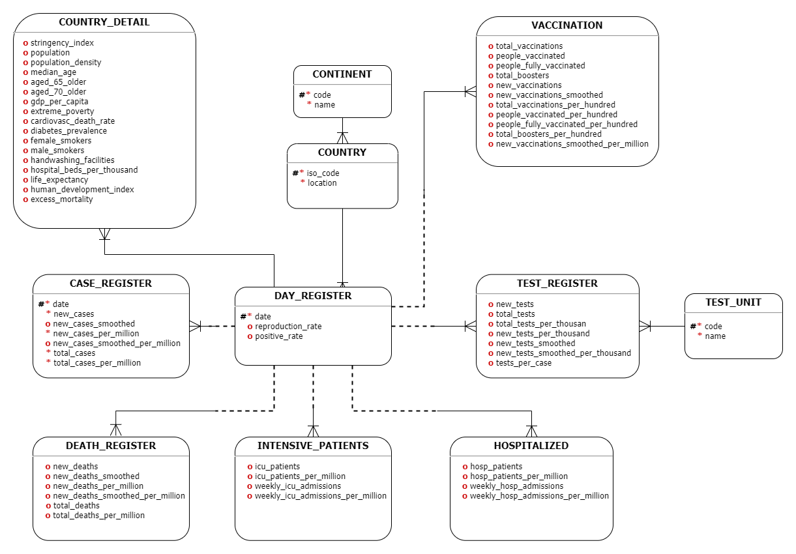

- [**Marco Teórico**](#marco-teórico)
- [**Modelo Conceptual:**](#modelo-conceptual)
- [**Modelo Lógico**](#modelo-lógico)
- [**Modelo Físico**](#modelo-físico)
- [**Glosario**](#glosario)

# **Marco Teórico**

# **Modelo Conceptual:**

 

    

 

Explicación de las entidades y sus atributos:

# **Modelo Lógico**

# **Modelo Físico**

# **Glosario**
