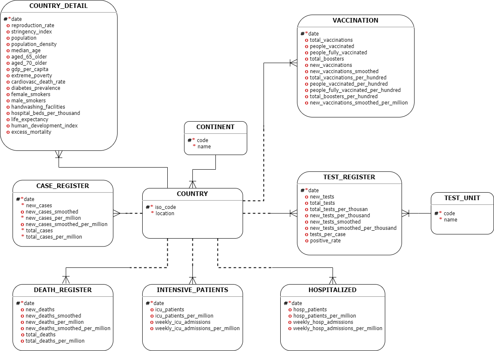

### Universidad de San Carlos de Guatemala

### Facultad de Ingeniería

### Escuela de Ciencias y Sistemas

### Sistemas de Bases de Datos 1 Sección A

### Catedrático: Otto Amilcar Rodriguez Acosta

### Tutor Académico: Andrés Alejandro Montúfar Cordero

### Práctica 1

### **Estudiante:** Kevin José Sandoval Catalán

### **Registro académico:** 201807265

### 
Guatemala 05 de Septiembre 2021

 
 
 
 

---

## Contenido

- [**Marco Teórico**](#marco-teórico)
- [**Modelo Conceptual:**](#modelo-conceptual)
  - [**🌍 CONTINENT:**](#-continent)
  - [**🗺️ COUNTRY:**](#️-country)
  - [**📈 CASE_REGISTER:**](#-case_register)
  - [**💀 DEATH_REGISTER:**](#-death_register)
  - [**🚑 INTENSIVE_PATIENTS:**](#-intensive_patients)
  - [**🏥 HOSPITALIZED:**](#-hospitalized)
  - [**📓 TEST_REGISTER:**](#-test_register)
  - [**📜 TEST_UNIT:**](#-test_unit)
  - [**💉 VACCINATION:**](#-vaccination)
  - [**📊 COUNTRY_DETAIL:**](#-country_detail)
- [**Modelo Lógico**](#modelo-lógico)
- [**Modelo Físico**](#modelo-físico)
- [**Glosario**](#glosario)

 
 

# **Marco Teórico**

# **Modelo Conceptual:**

 

    

 

Explicación de las entidades y sus atributos:
## **🌍 CONTINENT:**  
Es una entidad que se encarga de almacenar los distintos continentes que se registren durante el proceso de análisis de COVID-19.
<table table border="3">
    <thead>
        <tr>
            <th align="left">Atributo</th>
            <th align="left">Descripción</th>
        </tr>
    </thead>
    <tbody>
        <tr>
            <td align="left"><code>code</code></td>
            <td align="left">Código único que identifica a cada continente</td>
        </tr>
        <tr>
            <td align="left"><code>name</code></td>
            <td align="left">Continente de la ubicación geográfica</td>
        </tr>
    </tbody>
</table>  

## **🗺️ COUNTRY:**  
Entidad que almacena el iso_code y el nombre de un país en específico.
<table table border="3">
    <thead>
        <tr>
            <th align="left">Atributo</th>
            <th align="left">Descripción</th>
        </tr>
    </thead>
    <tbody>
        <tr>
            <td align="left"><code>iso_code</code></td>
            <td align="left">Código cada país de tres letras</td>
        </tr>
        <tr>
            <td align="left"><code>location</code></td>
            <td align="left">Localización geográfica</td>
        </tr>
    </tbody>
</table>

## **📈 CASE_REGISTER:**  
Entidad encargada de registrar la información relacionada con los casos de COVID-19 en determinada fecha.
<table table border="3">
    <thead>
        <tr>
            <th align="left">Atributo</th>
            <th align="left">Descripción</th>
        </tr>
    </thead>
    <tbody>
        <tr>
            <td align="left"><code>date</code></td>
            <td align="left">Fecha de análisis</td>
        </tr>    
        <tr>
            <td align="left"><code>new_cases</code></td>
            <td align="left">Nuevos casos confirmados de COVID-19</td>
        </tr>
        <tr>
            <td align="left"><code>new_cases_smoothed</code></td>
            <td align="left">Nuevos casos confirmados de COVID-19 (suavizado durante 7 días)</td>
        </tr>
        <tr>
            <td align="left"><code>new_cases_per_million</code></td>
            <td align="left">Nuevos casos confirmados de COVID-19 por cada 1.000.000 de personas</td>
        </tr>
        <tr>
            <td align="left"><code>new_cases_smoothed_per_million</code></td>
            <td align="left">Nuevos casos confirmados de COVID-19 (suavizado en 7 días) por cada 1.000.000 de personas</td>
        </tr>
        <tr>
            <td align="left"><code>total_cases</code></td>
            <td align="left">Total de casos confirmados de COVID-19</td>
        </tr>
        <tr>
            <td align="left"><code>total_cases_per_million</code></td>
            <td align="left">Total de casos confirmados de COVID-19 por cada 1.000.000 de personas</td>
        </tr>         
    </tbody>
</table>

  
## **💀 DEATH_REGISTER:**
Entidad encargada de registrar la información relacionada con las muertes que ocasionó el COVID-19 en determinada fecha.

<table table border="3">
    <thead>
        <tr>
            <th align="left">Atributo</th>
            <th align="left">Descripción</th>
        </tr>
    </thead>
    <tbody>
        <tr>
            <td align="left"><code>date</code></td>
            <td align="left">Fecha de análisis</td>
        </tr> 
        <tr>
            <td align="left"><code>new_deaths</code></td>
            <td align="left">Nuevas muertes atribuidas al COVID-19</td>
        </tr>
        <tr>
            <td align="left"><code>new_deaths_smoothed</code></td>
            <td align="left">Nuevas muertes atribuidas al COVID-19 (suavizado durante 7 días)</td>
        </tr>
        <tr>
            <td align="left"><code>new_deaths_per_million</code></td>
            <td align="left">Nuevas muertes atribuidas al COVID-19 por cada 1,000,000 de personas</td>
        </tr>
        <tr>
            <td align="left"><code>new_deaths_smoothed_per_million</code></td>
            <td align="left">Nuevas muertes atribuidas al COVID-19 (suavizado en 7 días) por cada 1,000,000 de personas</td>
        </tr>
        <tr>
            <td align="left"><code>total_deaths</code></td>
            <td align="left">Total de muertes atribuidas al COVID-19</td>
        </tr>
        <tr>
            <td align="left"><code>total_deaths_per_million</code></td>
            <td align="left">Total de muertes atribuidas al COVID-19 por cada 1,000,000 de personas</td>
        </tr>         
    </tbody>
</table>

## **🚑 INTENSIVE_PATIENTS:**  
Entidad que registra información sobre los pacientes que están en unidades de cuidados intensivos, como sus admisiones semanales o indicadores más generales como: weekly_icu_admissions_per_million.

<table table border="3">
    <thead>
        <tr>
            <th align="left">Atributo</th>
            <th align="left">Descripción</th>
        </tr>
    </thead>
    <tbody>
        <tr>
            <td align="left"><code>date</code></td>
            <td align="left">Fecha de análisis</td>
        </tr>     
        <tr>
            <td align="left"><code>icu_patients</code></td>
            <td align="left">Número de pacientes con COVID-19 en unidades de cuidados intensivos (UCI) en un día determinado</td>
        </tr>
        <tr>
            <td align="left"><code>icu_patients_per_million</code></td>
            <td align="left">Número de pacientes con COVID-19 en unidades de cuidados intensivos (UCI) en un día determinado por cada 1.000.000 de personas</td>
        </tr>
        <tr>
            <td align="left"><code>weekly_icu_admissions</code></td>
            <td align="left">Número de pacientes COVID-19 recién admitidos en unidades de cuidados intensivos (UCI) en una semana determinada</td>
        </tr>
        <tr>
            <td align="left"><code>weekly_icu_admissions_per_million</code></td>
            <td align="left">Número de pacientes COVID-19 recién admitidos en unidades de cuidados intensivos (UCI) en una semana determinada por cada 1,000,000 de personas</td>
        </tr>        
    </tbody>
</table>

## **🏥 HOSPITALIZED:**  
Entidad encargada de almacenar información de pacientes que estuvieron en un hospital en determinado día, así como indicadores que comparan datos por millón de personas.
<table table border="3">
    <thead>
        <tr>
            <th align="left">Atributo</th>
            <th align="left">Descripción</th>
        </tr>
    </thead>
    <tbody>
        <tr>
            <td align="left"><code>date</code></td>
            <td align="left">Fecha de análisis</td>
        </tr>     
        <tr>
            <td align="left"><code>hosp_patients</code></td>
            <td align="left">Número de pacientes con COVID-19 en el hospital en un día determinado</td>
        </tr>
        <tr>
            <td align="left"><code>hosp_patients_per_million</code></td>
            <td align="left">Número de pacientes con COVID-19 en el hospital en un día determinado por cada 1.000.000 de personas</td>
        </tr>
        <tr>
            <td align="left"><code>weekly_hosp_admissions</code></td>
            <td align="left">Número de pacientes con COVID-19 recién admitidos en hospitales en una semana determinada</td>
        </tr>
        <tr>
            <td align="left"><code>weekly_hosp_admissions_per_million</code></td>
            <td align="left">Número de pacientes con COVID-19 recién admitidos en hospitales en una semana determinada por cada 1,000,000 de personas</td>
        </tr>
    </tbody>
</table>

## **📓 TEST_REGISTER:**
Entidad encargada de almacenar información referente a las pruebas de COVID-19 realizadas a personas, como pruebas por día o también el total acumulado de pruebas realizadas para determinado país.
<table table border="3">
    <thead>
        <tr>
            <th align="left">Atributo</th>
            <th align="left">Descripción</th>
        </tr>
    </thead>
    <tbody>
        <tr>
            <td align="left"><code>date</code></td>
            <td align="left">Fecha de análisis</td>
        </tr>     
        <tr>
            <td align="left"><code>new_tests</code></td>
            <td align="left">Nuevas pruebas para COVID-19 (solo calculadas para días consecutivos)</td>
        </tr>
        <tr>
            <td align="left"><code>total_tests</code></td>
            <td align="left">Pruebas totales para COVID-19</td>
        </tr>
        <tr>
            <td align="left"><code>total_tests_per_thousand</code></td>
            <td align="left">Pruebas totales para COVID-19 por cada 1000 personas</td>
        </tr>
        <tr>
            <td align="left"><code>new_tests_per_thousand</code></td>
            <td align="left">Nuevas pruebas para COVID-19 por cada 1000 personas</td>
        </tr>        
        <tr>
            <td align="left"><code>new_tests_smoothed</code></td>
            <td align="left">Nuevas pruebas para COVID-19 (suavizado durante 7 días). Para los países que no informan los datos de las pruebas a diario, asumimos que las pruebas cambiaron por igual todos los días durante cualquier período en el que no se informaron datos</td>
        </tr>
        <tr>
            <td align="left"><code>new_tests_smoothed_per_thousand</code></td>
            <td align="left">Nuevas pruebas para COVID-19 (suavizado de 7 días) por cada 1,000 personas</td>
        </tr>
        <tr>
            <td align="left"><code>tests_per_case</code></td>
            <td align="left">Pruebas realizadas por cada nuevo caso confirmado de COVID-19, dado como un promedio móvil de 7 días (esto es el inverso de positive_rate)</td>
        </tr>
        <tr>
            <td align="left"><code>positive_rate</code></td>
            <td align="left">La proporción de pruebas de COVID-19 que son positivas, dada como un promedio móvil de 7 días (esto es lo contrario de las pruebas por caso)</td>
        </tr>                  
    </tbody>
</table>

## **📜 TEST_UNIT:**
Entidad creada con el objetivo de almacenar un catálogo del tipo de pruebas unitarias que se relizan.
<table table border="3">
    <thead>
        <tr>
            <th align="left">Atributo</th>
            <th align="left">Descripción</th>
        </tr>
    </thead>
    <tbody>
        <tr>
            <td align="left"><code>code</code></td>
            <td align="left">Identificador único de cada test</td>
        </tr>
        <tr>
            <td align="left"><code>name</code></td>
            <td align="left">Unidades utilizadas por la ubicación para informar sus datos de prueba</td>
        </tr>       
    </tbody>
</table>

## **💉 VACCINATION:**
Entidad que se encarga de almacenar toda información relacionada con las vacunas de COVID-19 administradas, entre algunos campos que registra están: total de dosis administradas, personas que recibieron por lo menos una dosis, entre otros. 
<table table border="3">
    <thead>
        <tr>
            <th align="left">Atributo</th>
            <th align="left">Descripción</th>
        </tr>
    </thead>
    <tbody>
        <tr>
            <td align="left"><code>date</code></td>
            <td align="left">Fecha de análisis</td>
        </tr>     
        <tr>
            <td align="left"><code>total_vaccinations</code></td>
            <td align="left">Número total de dosis de vacuna COVID-19 administradas</td>
        </tr>
        <tr>
            <td align="left"><code>people_vaccinated</code></td>
            <td align="left">Número total de personas que recibieron al menos una dosis de vacuna</td>
        </tr>
        <tr>
            <td align="left"><code>people_fully_vaccinated</code></td>
            <td align="left">Número total de personas que recibieron todas las dosis prescritas por el protocolo de vacunación</td>
        </tr>
        <tr>
            <td align="left"><code>total_boosters</code></td>
            <td align="left">Número total de dosis de refuerzo de la vacuna COVID-19 administradas (dosis administradas más allá del número prescrito por el protocolo de vacunación)</td>
        </tr> 
        <tr>
            <td align="left"><code>new_vaccinations</code></td>
            <td align="left">Nuevas dosis de vacuna COVID-19 administradas (solo calculadas para días consecutivos)</td>
        </tr>
        <tr>
            <td align="left"><code>new_vaccinations_smoothed</code></td>
            <td align="left">Se administran nuevas dosis de vacuna COVID-19 (suavizado de 7 días). Para los países que no informan los datos de vacunación a diario, asumimos que la vacunación cambió por igual a diario durante cualquier período en el que no se informaron datos </td>
        </tr>
        <tr>
            <td align="left"><code>total_vaccinations_per_hundred</code></td>
            <td align="left">Número total de dosis de vacuna COVID-19 administradas por cada 100 personas en la población total</td>
        </tr>
        <tr>
            <td align="left"><code>people_vaccinated_per_hundred<code></code></td>
            <td align="left">Número total de personas que recibieron al menos una dosis de vacuna por cada 100 personas en la población total</td>
        </tr>
        <tr>
            <td align="left"><code>people_fully_vaccinated_per_hundred<code></code></td>
            <td align="left">Número total de personas que recibieron todas las dosis prescritas por el protocolo de vacunación por cada 100 personas en la población total</td>
        </tr>  
        <tr>
            <td align="left"><code>total_boosters_per_hundred<code></code></td>
            <td align="left">Número total de dosis de refuerzo de la vacuna COVID-19 administradas por cada 100 personas en la población total</td>
        </tr>  
        <tr>
            <td align="left"><code>new_vaccinations_smoothed_per_million<code></code></td>
            <td align="left">Nuevas dosis de vacuna COVID-19 administradas (suavizado de 7 días) por cada 1.000.000 de personas en la población total</td>
        </tr>
    </tbody>
</table>

## **📊 COUNTRY_DETAIL:**
Entidad que almacena campos más generales de la información que puede necesitar determinado país, como su población, experanza de vida y algunos índices referentes al análisis del COVID-19.
<table table border="3">
    <thead>
        <tr>
            <th align="left">Atributo</th>
            <th align="left">Descripción</th>
        </tr>
    </thead>
    <tbody>
        <tr>
            <td align="left"><code>date</code></td>
            <td align="left">Fecha de análisis</td>
        </tr> 
        <tr>
            <td align="left"><code>reproduction_rate</code></td>
            <td align="left">Estimación en tiempo real de la tasa de reproducción efectiva (R) de COVID-19</td>
        </tr>             
        <tr>
            <td align="left"><code>stringency_index</code></td>
            <td align="left">Índice de rigurosidad de respuesta del gobierno: medida compuesta basada en 9 indicadores de respuesta que incluyen cierres de escuelas, cierres de lugares de trabajo y prohibiciones de viaje, reescalado a un valor de 0 a 100 (100 = respuesta más estricta)</td>
        </tr>
        <tr>
            <td align="left"><code>population</code></td>
            <td align="left">Población en 2020</td>
        </tr>
        <tr>
            <td align="left"><code>population_density</code></td>
            <td align="left">Número de personas dividido por área de tierra, medido en kilómetros cuadrados, año más reciente disponible</td>
        </tr>
        <tr>
            <td align="left"><code>median_age</code></td>
            <td align="left">Edad media de la población, proyección de la ONU para 2020</td>
        </tr> 
        <tr>
            <td align="left"><code>aged_65_older</code></td>
            <td align="left">Proporción de la población de 65 años o más, año más reciente disponible</td>
        </tr>
        <tr>
            <td align="left"><code>aged_70_older</code></td>
            <td align="left">Proporción de la población de 70 años o más en 2015</td>
        </tr>
        <tr>
            <td align="left"><code>gdp_per_capita</code></td>
            <td align="left">Producto interno bruto a paridad del poder adquisitivo (dólares internacionales constantes de 2011), año más reciente disponible</td>
        </tr>
        <tr>
            <td align="left"><code>extreme_poverty</code></td>
            <td align="left">Proporción de la población que vive en pobreza extrema, último año disponible desde 2010</td>
        </tr>
        <tr>
            <td align="left"><code>cardiovasc_death_rate</code></td>
            <td align="left">Tasa de mortalidad por enfermedad cardiovascular en 2017 (número anual de muertes por cada 100.000 personas)</td>
        </tr>  
        <tr>
            <td align="left"><code>diabetes_prevalence</code></td>
            <td align="left">Prevalencia de diabetes (% de la población de 20 a 79 años) en 2017</td>
        </tr>  
        <tr>
            <td align="left"><code>female_smokers</code></td>
            <td align="left">Proporción de mujeres que fuman, año más reciente disponible</td>
        </tr>
        <tr>
            <td align="left"><code>male_smokers</code></td>
            <td align="left">Proporción de hombres que fuman, año más reciente disponible</td>
        </tr>  
        <tr>
            <td align="left"><code>handwashing_facilities</code></td>
            <td align="left">Proporción de la población con instalaciones básicas para lavarse las manos en las instalaciones, año más reciente disponible</td>
        </tr>
        <tr>
            <td align="left"><code>hospital_beds_per_thousand</code></td>
            <td align="left">Camas de hospital por cada 1,000 personas, año más reciente disponible desde 2010</td>
        </tr>  
        <tr>
            <td align="left"><code>life_expectancy</code></td>
            <td align="left">Esperanza de vida al nacer en 2019</td>
        </tr>
        <tr>
            <td align="left"><code>human_development_index</code></td>
            <td align="left">Índice compuesto que mide el logro promedio en tres dimensiones básicas del desarrollo humano: una vida larga y saludable, conocimientos y un nivel de vida decente. Valores para 2019</td>
        </tr> 
        <tr>
            <td align="left"><code>excess_mortality</code></td>
            <td align="left">Puntajes de exceso de mortalidad para todas las edades</td>
        </tr>
    </tbody>
</table>
 
 

# **Modelo Lógico**  

<table border="3">
    <caption style="background: #65676B; color: white;">CONTINENT</caption>
    <thead>
        <tr style="background: #86324C;">
            <td  align="left">COLUMNAS</td>
            <td align="left">code</td>
            <td align="left">name</td>
        </tr>
        <tr style="background: #0F224E">
            <td align="left">RESTRICCIONES</td>
            <td align="left">PK</td>
            <td align="left">NN</td>
        </tr>
    </thead>
    <tbody>
        <tr>
            <td align="left"></td>
            <td align="left">1</td>
            <td align="left">Asia</td>
        </tr>
        <tr>
            <td align="left"></td>
            <td align="left">2</td>
            <td align="left">Europe</td>
        </tr>
        <tr>
            <td align="left"></td>
            <td align="left">3</td>
            <td align="left">Africa</td>
        </tr>
        <tr>
            <td align="left"></td>
            <td align="left">4</td>
            <td align="left">North America</td>
        </tr>
        <tr>
            <td align="left"></td>
            <td align="left">5</td>
            <td align="left">South America</td>
        </tr>
        <tr>
            <td align="left"></td>
            <td align="left">6</td>
            <td align="left">Oceania</td>
        </tr>        
    </tbody>
</table>

 

<table border="3">
    <caption style="background: #65676B; color: white;">COUNTRY</caption>
    <thead>
        <tr style="background: #86324C;">
            <td  align="left">COLUMNAS</td>
            <td align="left">iso_code</td>
            <td align="left">location</td>
            <td align="left">code (CONTINENT)</td>
        </tr>
        <tr style="background: #0F224E">
            <td align="left">RESTRICCIONES</td>
            <td align="left">PK</td>
            <td align="left">NN</td>
            <td align="left">FK</td>
        </tr>
    </thead>
    <tbody>
        <tr>
            <td align="left"></td>
            <td align="left">HUN</td>
            <td align="left">Hungary</td>
            <td align="left">2</td>
        </tr>
        <tr>
            <td align="left"></td>
            <td align="left">HKG</td>
            <td align="left">Hong Kong</td>
            <td align="left">1</td>
        </tr>
        <tr>
            <td align="left"></td>
            <td align="left">BHS</td>
            <td align="left">Bahamas</td>
            <td align="left">4</td>
        </tr>
        <tr>
            <td align="left"></td>
            <td align="left">ZWE</td>
            <td align="left">Zimbabwe</td>
            <td align="left">3</td>
        </tr>
        <tr>
            <td align="left"></td>
            <td align="left">SLB</td>
            <td align="left">Solomon Islands</td>
            <td align="left">6</td>
        </tr>
        <tr>
            <td align="left"></td>
            <td align="left">ESP</td>
            <td align="left">Spain</td>
            <td align="left">2</td>
        </tr>        
    </tbody>
</table>
 

 

<table border="3">
    <caption style="background: #65676B; color: white;">CASE_REGISTER</caption>
    <thead>
        <tr style="background: #86324C;">
            <td  align="left">COLUMNAS</td>
            <td align="left">date</td>
            <td align="left">new_cases</td>
            <td align="left">new_cases_smoothed</td>
            <td align="left">new_cases_per_million</td>
            <td align="left">new_cases_smoothed_per_million</td>
            <td align="left">total_cases</td>
            <td align="left">total_cases_per_million</td>
            <td align="left">iso_code (COUNTRY)</td>
        </tr>
        <tr style="background: #0F224E">
            <td align="left">RESTRICCIONES</td>
            <td align="left">PK</td>
            <td align="left">NN</td>
            <td align="left"></td>
            <td align="left">NN</td>
            <td align="left"></td>
            <td align="left">NN</td>
            <td align="left">NN</td>
            <td align="left">FK</td>
        </tr>
    </thead>
    <tbody>
        <tr>
            <td align="left"></td>
            <td align="left">2020/01/28</td>
            <td align="left">0</td>
            <td align="left">1.143</td>
            <td align="left">0</td>
            <td align="left">0.151</td>
            <td align="left">8</td>
            <td align="left">1.059</td>
            <td align="left">HKG</td>
        </tr>
        <tr>
            <td align="left"></td>
            <td align="left">2020/03/16</td>
            <td align="left">7</td>
            <td align="left">4.286</td>
            <td align="left">0.727</td>
            <td align="left">0.445</td>
            <td align="left">39</td>
            <td align="left">4.048</td>
            <td align="left">HUN</td>       
        </tr>
        <tr>
            <td align="left"></td>
            <td align="left">2020/04/06</td>
            <td align="left">1</td>
            <td align="left">2.143</td>
            <td align="left">2.519</td>
            <td align="left">5.399</td>
            <td align="left">29</td>
            <td align="left">73.064</td>
            <td align="left">BHS</td>
        </tr>
        <tr>
            <td align="left"></td>
            <td align="left">2020/10/18</td>
            <td align="left">0</td>
            <td align="left">0.429</td>
            <td align="left">0</td>
            <td align="left">0.609</td>
            <td align="left">3</td>
            <td align="left">4.261</td>  
            <td align="left">SLB</td>       
        </tr>
        <tr>
            <td align="left"></td>
            <td align="left">2021/05/03</td>
            <td align="left">16353</td>
            <td align="left">7423</td>
            <td align="left">349.833</td>
            <td align="left">158.797</td>
            <td align="left">3540430</td>
            <td align="left">75738.882</td>
            <td align="left">ESP</td>
        </tr>         
        <tr>
            <td align="left"></td>
            <td align="left">2021/08/13</td>
            <td align="left">754</td>
            <td align="left">580.429</td>
            <td align="left">49.96</td>
            <td align="left">38.459</td>
            <td align="left">119508</td>
            <td align="left">7918.543</td>
            <td align="left">ZWE</td>       
        </tr>                
    </tbody>
</table>

# **Modelo Físico**

# **Glosario**
