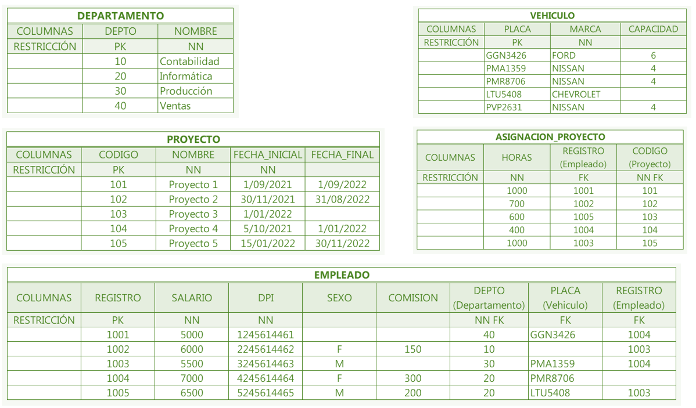

### Universidad de San Carlos de Guatemala

### Facultad de Ingeniería

### Escuela de Ciencias y Sistemas

### Sistemas de Bases de Datos 1 Sección A

### Catedrático: Otto Amilcar Rodriguez Acosta

### Tutor Académico: Andrés Alejandro Montúfar Cordero

### Práctica 1

<p align="center"></p>

### **Estudiante:** Kevin José Sandoval Catalán

### **Registro académico:** 201807265

### <p align="center">Guatemala 05 de Septiembre 2021</p>

<br/>
<br/>
<br/>
<br/>

---

## Contenido

- [**Marco Teórico**](#marco-teórico)
- [**Modelo Conceptual:**](#modelo-conceptual)
  - [**🌍 CONTINENT:**](#-continent)
  - [**🗺️ COUNTRY:**](#️-country)
  - [**📈 CASE_REGISTER:**](#-case_register)
  - [**💀 DEATH_REGISTER:**](#-death_register)
  - [**🚑 INTENSIVE_PATIENTS:**](#-intensive_patients)
  - [**🏥 HOSPITALIZED:**](#-hospitalized)
  - [**📓 TEST_REGISTER:**](#-test_register)
  - [**📜 TEST_UNIT:**](#-test_unit)
  - [**💉 VACCINATION:**](#-vaccination)
  - [**📊 COUNTRY_DETAIL:**](#-country_detail)
- [**Modelo Lógico**](#modelo-lógico)
    - [**CONTINENT**](#continent)
    - [**COUNTRY**](#country)
    - [**CASE_REGISTER**](#case_register)
    - [**DEATH_REGISTER**](#death_register)
    - [**INTENSIVE_PATIENTS**](#intensive_patients)
    - [**HOSPITALIZED**](#hospitalized)
    - [**TEST_UNIT**](#test_unit)
    - [**TEST_REGISTER**](#test_register)
    - [**VACCINATION**](#vaccination)
    - [**COUNTRY_DETAIL**](#country_detail)
- [**Modelo Físico**](#modelo-físico)
- [**Glosario**](#glosario)

<br/>
<br/>

# **Marco Teórico**

**<h1 align="center">Modelos de datos</h1>**

<div style="text-align: justify">
Los modelos de datos definen cómo se modela la estructura lógica de una base de datos, estos son entidades fundamentales para introducir la abstracción en una base de datos y definen cómo los datos se conectan entre sí y cómo se procesan y almacenan dentro del sistema.
</div>
</br>
<div style="text-align: justify">
El primer modelo de datos fue el modelo de datos planos, donde todos los datos utilizados se mantendrían en el mismo plano. Los primeros modelos de datos no eran tan científicos, por lo tanto, eran propensos a introducir muchas anomalías de duplicación y actualización.
Un modelo de datos puede ser concreto o abstracto, y están representados por la notación de modelado de datos, que a menudo se presenta en formato gráfico. Su enfoque principal es apoyar y ayudar a los sistemas de información mostrando el formato y la definición de los diferentes datos involucrados. También ayudan a evitar la redundancia de datos. La información almacenada en los modelos de datos es de gran importancia para las empresas porque dicta las relaciones entre las tablas de la base de datos, las claves externas y los eventos involucrados.  
</div>
</br>

<div style="text-align: justify">
Un modelo de datos puede ser concreto o abstracto, y están representados por la notación de modelado de datos, que a menudo se presenta en formato gráfico. Su enfoque principal es apoyar y ayudar a los sistemas de información mostrando el formato y la definición de los diferentes datos involucrados. También ayudan a evitar la redundancia de datos. La información almacenada en los modelos de datos es de gran importancia para las empresas porque dicta las relaciones entre las tablas de la base de datos, las claves externas y los eventos involucrados.  
</div>


Los tres tipos básicos de modelo de datos son:
- Modelos de datos conceptuales
- Modelos de datos físicos
- Modelos de datos lógicos

***

**<h2 align="center">"Modelo conceptual"</h2>**

<div style="text-align: justify">

Un modelo conceptual de datos identifica las relaciones de más alto nivel entre las diferentes entidades. Las características del modelo conceptual de datos incluye las entidades importantes y las relaciones entre ellas, en este modelo no se especifica ningún atributo y tampoco se especifica ninguna clave principal.
</div>

<p align="center">

</p>

**✔️ENTIDADES:** Una entidad es “algo” con significado del cual se necesita llevar información.  
**✔️ ATRIBUTOS:** Los atributos identifican, cualifican, o cuantifican o describen a una entidad.  
**✔️ INSTANCIAS DE UNA ENTIDAD:** Una entidad tiene múltiples ocurrencias o instancias que consisten en valores específicos para los atributos de una entidad.   
**✔️  TIPOS DE ATRIBUTOS:**
- IDENTIFICADORES UNICOS: Cada instancia debe ser identificada de forma única de otras instancias de la misma entidad. Un identificador único (UID) es cualquier combinación de atributos que sirven para identificar de forma única a una instancia de una Entidad.
- ATRIBUTOS OPCIONALES Y OBLIGATORIOS: Un atributo es opcional si para una instancia cualquiera de la entidad existe la posibilidad de que no tenga valor. Un atributo es obligatorio si para cualquier instancia el atributo siempre debe tener valor.  

**✔️ DIAGRAMACION DE ENTIDADES:** Existen diferentes notaciones para representar las entidades, la notación más utilizada es de barkers.  
**✔️ RELACIONES:** Una relación es una asociación bidireccional entre dos o mas entidades o entre una entidad y ella misma. Existen tres tipos de relaciones:
- Uno a Muchos 1:M 1:*
- Uno a uno 1:1 
- Muchos a Muchos M:M *:*  

**✔️ CARDINALIDAD:** La cardinalidad define con cuantas instancias de otra entidad puede está relacionada una instancia. La cardinalidad puede ser: Uno y solo uno ó de uno a muchos.  
**✔️ OPCIONALIDAD:** La opcionalidad indica si existe la posibilidad de que una instancia no esté relacionada con ninguna otra instancia en la relación.  

</br>

***

**<h2 align="center">"Modelo lógico"</h2>**

Un modelo de datos lógicos describe los datos con el mayor detalle posible, independientemente de cómo se implementarán físicamente en la base de datos. Las características de un modelo de datos lógicos incluyen:    
</br>

- Incluye todas las entidades y relaciones entre ellos.  
- Todos los atributos para cada entidad están especificados.  
- La clave principal para cada entidad está especificada.  
- Se especifican las claves externas (claves que identifican la relación entre diferentes entidades).  
- La normalización ocurre en este nivel.  

Mape o transformación hacia el modelo lógico.
<table table border="3">
    <thead>
        <tr>
            <th align="left">Modelo de datos</th>
            <th align="left">Se convierte en</th>
            <th align="left">Modelo relacional</th>
        </tr>
    </thead>
    <tbody>
        <tr>
            <td align="left"><code>Entidades</code></td>
            <th align="left">➜</th>
            <td align="left">Tablas</td>
        </tr>
        <tr>
            <td align="left"><code>Atributos</code></td>
            <th align="left">➜</th>
            <td align="left">Columnas de la tabla</td>
        </tr>
        <tr>
            <td align="left"><code>Si el atributo es: Identificador Unico #</code></td>
            <th align="left">➜</th>
            <td align="left">Llave Primaria (PK)</td>
        </tr>
        <tr>
            <td align="left"><code>Si el atributo es:  Obligatorio *</code></td>
            <th align="left">➜</th>
            <td align="left">NOT NULL</td>
        </tr>
        <tr>
            <td align="left"><code>Si el atributo es: Opcional o</code></td>
            <th align="left">➜</th>
            <td align="left">NULL</td>
        </tr>
        <tr>
            <td align="left"><code>Si el atributo es: Llave candidata (#)</code></td>
            <th align="left">➜</th>
            <td align="left">Unique</td>
        </tr>         
    </tbody>
</table> 

</br>

**<h2>Ejemplo:</h2>**
</br>
<p align="center">
    
</p>

***

**<h2 align="center">"Modelo físico"</h2>**

<div style="text-align: justify">
El modelo de datos físicos representa cómo se construirá el modelo en la base de datos. Un modelo de base de datos física muestra todas las estructuras de tabla, incluidos el nombre de columna, el tipo de datos de columna, las restricciones de columna, la clave principal, la clave externa y las relaciones entre las tablas.
</div>
</br>


Las características de un modelo de datos físicos incluyen:

- Especificación de todas las tablas y columnas.
- Las claves externas se usan para identificar relaciones entre tablas.
- La desnormalización puede ocurrir según los requisitos del usuario.
- Las consideraciones físicas pueden hacer que el modelo de datos físicos sea bastante diferente del modelo de datos lógicos.

<div style="text-align: justify">
El modelo de datos físicos será diferente para diferentes Sistemas de Gestión de Base de datos. Por ejemplo, el tipo de datos para una columna puede ser diferente entre MySQL y SQL Server. Los pasos básico para el diseño del modelo de datos físicos son los siguientes:
</div>
</br>

- Convertir entidades en tablas.
- Convertir relaciones en claves externas.
- Convertir atributos en columnas.
- Modificar el modelo de datos físicos en función de las restricciones.

**<h2>Ejemplo:</h2>**  
**DDL**
```sql
/* Definiendo secuencias */
CREATE SEQUENCE departamento_seq START WITH 1 INCREMENT BY 1;
CREATE SEQUENCE proyecto_seq START WITH 1 INCREMENT BY 1;
CREATE SEQUENCE empleado_seq START WITH 1 INCREMENT BY 1;

/* DEFINIENDO EL ESQUEMA DE LA BASE DE DATOS */

/* DDL */
CREATE TABLE Departamento (
    depto NUMBER default departamento_seq.nextval,
    nombre VARCHAR2(30) NOT NULL,
    
    CONSTRAINT departamento_PK PRIMARY KEY (depto)
);

CREATE TABLE Vehiculo (
    placa VARCHAR2(10),
    marca VARCHAR2(15) NOT NULL,
    capacidad NUMBER,
    
    CONSTRAINT departamento_PK PRIMARY KEY (placa)
);

CREATE TABLE Proyecto (
    codigo NUMBER default proyecto_seq.nextval,
    nombre VARCHAR2(20) NOT NULL,
    fecha_inicial DATE NOT NULL,
    fecha_final DATE,
    
    CONSTRAINT proyecto_PK PRIMARY KEY (codigo)
);

CREATE TABLE Empleado (
    registro NUMBER default empleado_seq.nextval,
    salario DECIMAL(8, 2) NOT NULL,
    dpi VARCHAR2(20) NOT NULL,
    sexo VARCHAR2(1),
    comision DECIMAL(8, 2),
    depto NUMBER NOT NULL,
    placa VARCHAR2(10),
    registro_jefe NUMBER,
    
    CONSTRAINT proyecto_PK PRIMARY KEY (registro),
    CONSTRAINT empleado_depto_FK FOREIGN KEY (depto) REFERENCES Departamento(depto),
    CONSTRAINT empleado_vehiculo_FK FOREIGN KEY (placa) REFERENCES Vehiculo(placa),
    CONSTRAINT empleado_empleado_FK FOREIGN KEY (registro_jefe) REFERENCES Empleado(registro)
);

CREATE TABLE Asignacion_Proyecto(
    registro NUMBER,
    codigo NUMBER,
    horas NUMBER NOT NULL,

    CONSTRAINT asignacion_proyecto_PK PRIMARY KEY (registro, codigo),
);


```

**DML**

```sql
/* Departamento */
INSERT INTO Departamento (nombre) VALUES ('Contabilidad');
INSERT INTO Departamento (nombre) VALUES ('Informática');
INSERT INTO Departamento (nombre) VALUES ('Producción');
INSERT INTO Departamento (nombre) VALUES ('Ventas');

INSERT INTO Departamento (placa, marca, capacidad) VALUES ('GGN3426', 'FORD', 6);
INSERT INTO Departamento (placa, marca, capacidad) VALUES ('PMA1359', 'NISSAN', 4);
INSERT INTO Departamento (placa, marca, capacidad) VALUES ('PMR8706', 'NISSAN', 4);
INSERT INTO Departamento (placa, marca) VALUES ('LTU5408', 'CHEVROLET');
INSERT INTO Departamento (placa, marca, capacidad) VALUES ('PVP2631', 'NISSAN', 4);
```

***
</br>


# **Modelo Conceptual:**

<br/>
<p align="center">
    
</p>
<br/>

Explicación de las entidades y sus atributos:
## **🌍 CONTINENT:**  
Es una entidad que se encarga de almacenar los distintos continentes que se registren durante el proceso de análisis de COVID-19.
<table table border="3">
    <thead>
        <tr>
            <th align="left">Atributo</th>
            <th align="left">Descripción</th>
        </tr>
    </thead>
    <tbody>
        <tr>
            <td align="left"><code>code</code></td>
            <td align="left">Código único que identifica a cada continente</td>
        </tr>
        <tr>
            <td align="left"><code>name</code></td>
            <td align="left">Continente de la ubicación geográfica</td>
        </tr>
    </tbody>
</table>  

## **🗺️ COUNTRY:**  
Entidad que almacena el iso_code y el nombre de un país en específico.
<table table border="3">
    <thead>
        <tr>
            <th align="left">Atributo</th>
            <th align="left">Descripción</th>
        </tr>
    </thead>
    <tbody>
        <tr>
            <td align="left"><code>iso_code</code></td>
            <td align="left">Código cada país de tres letras</td>
        </tr>
        <tr>
            <td align="left"><code>location</code></td>
            <td align="left">Localización geográfica</td>
        </tr>
    </tbody>
</table>


## **📈 CASE_REGISTER:**  
Entidad encargada de registrar la información relacionada con los casos de COVID-19 en determinada fecha.
<table table border="3">
    <thead>
        <tr>
            <th align="left">Atributo</th>
            <th align="left">Descripción</th>
        </tr>
    </thead>
    <tbody>
        <tr>
            <td align="left"><code>date</code></td>
            <td align="left">Fecha de análisis</td>
        </tr>    
        <tr>
            <td align="left"><code>new_cases</code></td>
            <td align="left">Nuevos casos confirmados de COVID-19</td>
        </tr>
        <tr>
            <td align="left"><code>new_cases_smoothed</code></td>
            <td align="left">Nuevos casos confirmados de COVID-19 (suavizado durante 7 días)</td>
        </tr>
        <tr>
            <td align="left"><code>new_cases_per_million</code></td>
            <td align="left">Nuevos casos confirmados de COVID-19 por cada 1.000.000 de personas</td>
        </tr>
        <tr>
            <td align="left"><code>new_cases_smoothed_per_million</code></td>
            <td align="left">Nuevos casos confirmados de COVID-19 (suavizado en 7 días) por cada 1.000.000 de personas</td>
        </tr>
        <tr>
            <td align="left"><code>total_cases</code></td>
            <td align="left">Total de casos confirmados de COVID-19</td>
        </tr>
        <tr>
            <td align="left"><code>total_cases_per_million</code></td>
            <td align="left">Total de casos confirmados de COVID-19 por cada 1.000.000 de personas</td>
        </tr>         
    </tbody>
</table>

  
## **💀 DEATH_REGISTER:**
Entidad encargada de registrar la información relacionada con las muertes que ocasionó el COVID-19 en determinada fecha.

<table table border="3">
    <thead>
        <tr>
            <th align="left">Atributo</th>
            <th align="left">Descripción</th>
        </tr>
    </thead>
    <tbody>
        <tr>
            <td align="left"><code>date</code></td>
            <td align="left">Fecha de análisis</td>
        </tr> 
        <tr>
            <td align="left"><code>new_deaths</code></td>
            <td align="left">Nuevas muertes atribuidas al COVID-19</td>
        </tr>
        <tr>
            <td align="left"><code>new_deaths_smoothed</code></td>
            <td align="left">Nuevas muertes atribuidas al COVID-19 (suavizado durante 7 días)</td>
        </tr>
        <tr>
            <td align="left"><code>new_deaths_per_million</code></td>
            <td align="left">Nuevas muertes atribuidas al COVID-19 por cada 1,000,000 de personas</td>
        </tr>
        <tr>
            <td align="left"><code>new_deaths_smoothed_per_million</code></td>
            <td align="left">Nuevas muertes atribuidas al COVID-19 (suavizado en 7 días) por cada 1,000,000 de personas</td>
        </tr>
        <tr>
            <td align="left"><code>total_deaths</code></td>
            <td align="left">Total de muertes atribuidas al COVID-19</td>
        </tr>
        <tr>
            <td align="left"><code>total_deaths_per_million</code></td>
            <td align="left">Total de muertes atribuidas al COVID-19 por cada 1,000,000 de personas</td>
        </tr>         
    </tbody>
</table>

## **🚑 INTENSIVE_PATIENTS:**  
Entidad que registra información sobre los pacientes que están en unidades de cuidados intensivos, como sus admisiones semanales o indicadores más generales como: weekly_icu_admissions_per_million.

<table table border="3">
    <thead>
        <tr>
            <th align="left">Atributo</th>
            <th align="left">Descripción</th>
        </tr>
    </thead>
    <tbody>
        <tr>
            <td align="left"><code>date</code></td>
            <td align="left">Fecha de análisis</td>
        </tr>     
        <tr>
            <td align="left"><code>icu_patients</code></td>
            <td align="left">Número de pacientes con COVID-19 en unidades de cuidados intensivos (UCI) en un día determinado</td>
        </tr>
        <tr>
            <td align="left"><code>icu_patients_per_million</code></td>
            <td align="left">Número de pacientes con COVID-19 en unidades de cuidados intensivos (UCI) en un día determinado por cada 1.000.000 de personas</td>
        </tr>
        <tr>
            <td align="left"><code>weekly_icu_admissions</code></td>
            <td align="left">Número de pacientes COVID-19 recién admitidos en unidades de cuidados intensivos (UCI) en una semana determinada</td>
        </tr>
        <tr>
            <td align="left"><code>weekly_icu_admissions_per_million</code></td>
            <td align="left">Número de pacientes COVID-19 recién admitidos en unidades de cuidados intensivos (UCI) en una semana determinada por cada 1,000,000 de personas</td>
        </tr>        
    </tbody>
</table>

## **🏥 HOSPITALIZED:**  
Entidad encargada de almacenar información de pacientes que estuvieron en un hospital en determinado día, así como indicadores que comparan datos por millón de personas.
<table table border="3">
    <thead>
        <tr>
            <th align="left">Atributo</th>
            <th align="left">Descripción</th>
        </tr>
    </thead>
    <tbody>
        <tr>
            <td align="left"><code>date</code></td>
            <td align="left">Fecha de análisis</td>
        </tr>     
        <tr>
            <td align="left"><code>hosp_patients</code></td>
            <td align="left">Número de pacientes con COVID-19 en el hospital en un día determinado</td>
        </tr>
        <tr>
            <td align="left"><code>hosp_patients_per_million</code></td>
            <td align="left">Número de pacientes con COVID-19 en el hospital en un día determinado por cada 1.000.000 de personas</td>
        </tr>
        <tr>
            <td align="left"><code>weekly_hosp_admissions</code></td>
            <td align="left">Número de pacientes con COVID-19 recién admitidos en hospitales en una semana determinada</td>
        </tr>
        <tr>
            <td align="left"><code>weekly_hosp_admissions_per_million</code></td>
            <td align="left">Número de pacientes con COVID-19 recién admitidos en hospitales en una semana determinada por cada 1,000,000 de personas</td>
        </tr>
    </tbody>
</table>


## **📓 TEST_REGISTER:**
Entidad encargada de almacenar información referente a las pruebas de COVID-19 realizadas a personas, como pruebas por día o también el total acumulado de pruebas realizadas para determinado país.
<table table border="3">
    <thead>
        <tr>
            <th align="left">Atributo</th>
            <th align="left">Descripción</th>
        </tr>
    </thead>
    <tbody>
        <tr>
            <td align="left"><code>date</code></td>
            <td align="left">Fecha de análisis</td>
        </tr>     
        <tr>
            <td align="left"><code>new_tests</code></td>
            <td align="left">Nuevas pruebas para COVID-19 (solo calculadas para días consecutivos)</td>
        </tr>
        <tr>
            <td align="left"><code>total_tests</code></td>
            <td align="left">Pruebas totales para COVID-19</td>
        </tr>
        <tr>
            <td align="left"><code>total_tests_per_thousand</code></td>
            <td align="left">Pruebas totales para COVID-19 por cada 1000 personas</td>
        </tr>
        <tr>
            <td align="left"><code>new_tests_per_thousand</code></td>
            <td align="left">Nuevas pruebas para COVID-19 por cada 1000 personas</td>
        </tr>        
        <tr>
            <td align="left"><code>new_tests_smoothed</code></td>
            <td align="left">Nuevas pruebas para COVID-19 (suavizado durante 7 días). Para los países que no informan los datos de las pruebas a diario, asumimos que las pruebas cambiaron por igual todos los días durante cualquier período en el que no se informaron datos</td>
        </tr>
        <tr>
            <td align="left"><code>new_tests_smoothed_per_thousand</code></td>
            <td align="left">Nuevas pruebas para COVID-19 (suavizado de 7 días) por cada 1,000 personas</td>
        </tr>
        <tr>
            <td align="left"><code>tests_per_case</code></td>
            <td align="left">Pruebas realizadas por cada nuevo caso confirmado de COVID-19, dado como un promedio móvil de 7 días (esto es el inverso de positive_rate)</td>
        </tr>
        <tr>
            <td align="left"><code>positive_rate</code></td>
            <td align="left">La proporción de pruebas de COVID-19 que son positivas, dada como un promedio móvil de 7 días (esto es lo contrario de las pruebas por caso)</td>
        </tr>                  
    </tbody>
</table>

## **📜 TEST_UNIT:**
Entidad creada con el objetivo de almacenar un catálogo del tipo de pruebas unitarias que se relizan.
<table table border="3">
    <thead>
        <tr>
            <th align="left">Atributo</th>
            <th align="left">Descripción</th>
        </tr>
    </thead>
    <tbody>
        <tr>
            <td align="left"><code>code</code></td>
            <td align="left">Identificador único de cada test</td>
        </tr>
        <tr>
            <td align="left"><code>name</code></td>
            <td align="left">Unidades utilizadas por la ubicación para informar sus datos de prueba</td>
        </tr>       
    </tbody>
</table>

## **💉 VACCINATION:**
Entidad que se encarga de almacenar toda información relacionada con las vacunas de COVID-19 administradas, entre algunos campos que registra están: total de dosis administradas, personas que recibieron por lo menos una dosis, entre otros. 
<table table border="3">
    <thead>
        <tr>
            <th align="left">Atributo</th>
            <th align="left">Descripción</th>
        </tr>
    </thead>
    <tbody>
        <tr>
            <td align="left"><code>date</code></td>
            <td align="left">Fecha de análisis</td>
        </tr>     
        <tr>
            <td align="left"><code>total_vaccinations</code></td>
            <td align="left">Número total de dosis de vacuna COVID-19 administradas</td>
        </tr>
        <tr>
            <td align="left"><code>people_vaccinated</code></td>
            <td align="left">Número total de personas que recibieron al menos una dosis de vacuna</td>
        </tr>
        <tr>
            <td align="left"><code>people_fully_vaccinated</code></td>
            <td align="left">Número total de personas que recibieron todas las dosis prescritas por el protocolo de vacunación</td>
        </tr>
        <tr>
            <td align="left"><code>total_boosters</code></td>
            <td align="left">Número total de dosis de refuerzo de la vacuna COVID-19 administradas (dosis administradas más allá del número prescrito por el protocolo de vacunación)</td>
        </tr> 
        <tr>
            <td align="left"><code>new_vaccinations</code></td>
            <td align="left">Nuevas dosis de vacuna COVID-19 administradas (solo calculadas para días consecutivos)</td>
        </tr>
        <tr>
            <td align="left"><code>new_vaccinations_smoothed</code></td>
            <td align="left">Se administran nuevas dosis de vacuna COVID-19 (suavizado de 7 días). Para los países que no informan los datos de vacunación a diario, asumimos que la vacunación cambió por igual a diario durante cualquier período en el que no se informaron datos </td>
        </tr>
        <tr>
            <td align="left"><code>total_vaccinations_per_hundred</code></td>
            <td align="left">Número total de dosis de vacuna COVID-19 administradas por cada 100 personas en la población total</td>
        </tr>
        <tr>
            <td align="left"><code>people_vaccinated_per_hundred<code></code></td>
            <td align="left">Número total de personas que recibieron al menos una dosis de vacuna por cada 100 personas en la población total</td>
        </tr>
        <tr>
            <td align="left"><code>people_fully_vaccinated_per_hundred<code></code></td>
            <td align="left">Número total de personas que recibieron todas las dosis prescritas por el protocolo de vacunación por cada 100 personas en la población total</td>
        </tr>  
        <tr>
            <td align="left"><code>total_boosters_per_hundred<code></code></td>
            <td align="left">Número total de dosis de refuerzo de la vacuna COVID-19 administradas por cada 100 personas en la población total</td>
        </tr>  
        <tr>
            <td align="left"><code>new_vaccinations_smoothed_per_million<code></code></td>
            <td align="left">Nuevas dosis de vacuna COVID-19 administradas (suavizado de 7 días) por cada 1.000.000 de personas en la población total</td>
        </tr>
    </tbody>
</table>

## **📊 COUNTRY_DETAIL:**
Entidad que almacena campos más generales de la información que puede necesitar determinado país, como su población, experanza de vida y algunos índices referentes al análisis del COVID-19.
<table table border="3">
    <thead>
        <tr>
            <th align="left">Atributo</th>
            <th align="left">Descripción</th>
        </tr>
    </thead>
    <tbody>
        <tr>
            <td align="left"><code>date</code></td>
            <td align="left">Fecha de análisis</td>
        </tr> 
        <tr>
            <td align="left"><code>reproduction_rate</code></td>
            <td align="left">Estimación en tiempo real de la tasa de reproducción efectiva (R) de COVID-19</td>
        </tr>             
        <tr>
            <td align="left"><code>stringency_index</code></td>
            <td align="left">Índice de rigurosidad de respuesta del gobierno: medida compuesta basada en 9 indicadores de respuesta que incluyen cierres de escuelas, cierres de lugares de trabajo y prohibiciones de viaje, reescalado a un valor de 0 a 100 (100 = respuesta más estricta)</td>
        </tr>
        <tr>
            <td align="left"><code>population</code></td>
            <td align="left">Población en 2020</td>
        </tr>
        <tr>
            <td align="left"><code>population_density</code></td>
            <td align="left">Número de personas dividido por área de tierra, medido en kilómetros cuadrados, año más reciente disponible</td>
        </tr>
        <tr>
            <td align="left"><code>median_age</code></td>
            <td align="left">Edad media de la población, proyección de la ONU para 2020</td>
        </tr> 
        <tr>
            <td align="left"><code>aged_65_older</code></td>
            <td align="left">Proporción de la población de 65 años o más, año más reciente disponible</td>
        </tr>
        <tr>
            <td align="left"><code>aged_70_older</code></td>
            <td align="left">Proporción de la población de 70 años o más en 2015</td>
        </tr>
        <tr>
            <td align="left"><code>gdp_per_capita</code></td>
            <td align="left">Producto interno bruto a paridad del poder adquisitivo (dólares internacionales constantes de 2011), año más reciente disponible</td>
        </tr>
        <tr>
            <td align="left"><code>extreme_poverty</code></td>
            <td align="left">Proporción de la población que vive en pobreza extrema, último año disponible desde 2010</td>
        </tr>
        <tr>
            <td align="left"><code>cardiovasc_death_rate</code></td>
            <td align="left">Tasa de mortalidad por enfermedad cardiovascular en 2017 (número anual de muertes por cada 100.000 personas)</td>
        </tr>  
        <tr>
            <td align="left"><code>diabetes_prevalence</code></td>
            <td align="left">Prevalencia de diabetes (% de la población de 20 a 79 años) en 2017</td>
        </tr>  
        <tr>
            <td align="left"><code>female_smokers</code></td>
            <td align="left">Proporción de mujeres que fuman, año más reciente disponible</td>
        </tr>
        <tr>
            <td align="left"><code>male_smokers</code></td>
            <td align="left">Proporción de hombres que fuman, año más reciente disponible</td>
        </tr>  
        <tr>
            <td align="left"><code>handwashing_facilities</code></td>
            <td align="left">Proporción de la población con instalaciones básicas para lavarse las manos en las instalaciones, año más reciente disponible</td>
        </tr>
        <tr>
            <td align="left"><code>hospital_beds_per_thousand</code></td>
            <td align="left">Camas de hospital por cada 1,000 personas, año más reciente disponible desde 2010</td>
        </tr>  
        <tr>
            <td align="left"><code>life_expectancy</code></td>
            <td align="left">Esperanza de vida al nacer en 2019</td>
        </tr>
        <tr>
            <td align="left"><code>human_development_index</code></td>
            <td align="left">Índice compuesto que mide el logro promedio en tres dimensiones básicas del desarrollo humano: una vida larga y saludable, conocimientos y un nivel de vida decente. Valores para 2019</td>
        </tr> 
        <tr>
            <td align="left"><code>excess_mortality</code></td>
            <td align="left">Puntajes de exceso de mortalidad para todas las edades</td>
        </tr>
    </tbody>
</table>
</br>
</br>

# **Modelo Lógico**  

### **CONTINENT**

<table border="3">
    <thead>
        <tr style="background: #86324C;">
            <td  align="left">COLUMNAS</td>
            <td align="left">code</td>
            <td align="left">name</td>
        </tr>
        <tr style="background: #0F224E">
            <td align="left">RESTRICCIONES</td>
            <td align="left">PK</td>
            <td align="left">NN</td>
        </tr>
    </thead>
    <tbody>
        <tr>
            <td align="left"></td>
            <td align="left">1</td>
            <td align="left">Asia</td>
        </tr>
        <tr>
            <td align="left"></td>
            <td align="left">2</td>
            <td align="left">Europe</td>
        </tr>
        <tr>
            <td align="left"></td>
            <td align="left">3</td>
            <td align="left">Africa</td>
        </tr>
        <tr>
            <td align="left"></td>
            <td align="left">4</td>
            <td align="left">North America</td>
        </tr>
        <tr>
            <td align="left"></td>
            <td align="left">5</td>
            <td align="left">South America</td>
        </tr>
        <tr>
            <td align="left"></td>
            <td align="left">6</td>
            <td align="left">Oceania</td>
        </tr>        
    </tbody>
</table>

</br>

### **COUNTRY**

<table border="3">
    <thead>
        <tr style="background: #86324C;">
            <td  align="left">COLUMNAS</td>
            <td align="left">iso_code</td>
            <td align="left">location</td>
            <td align="left">code (CONTINENT)</td>
        </tr>
        <tr style="background: #0F224E">
            <td align="left">RESTRICCIONES</td>
            <td align="left">PK</td>
            <td align="left">NN</td>
            <td align="left">FK</td>
        </tr>
    </thead>
    <tbody>
        <tr>
            <td align="left"></td>
            <td align="left">HUN</td>
            <td align="left">Hungary</td>
            <td align="left">2</td>
        </tr>
        <tr>
            <td align="left"></td>
            <td align="left">HKG</td>
            <td align="left">Hong Kong</td>
            <td align="left">1</td>
        </tr>
        <tr>
            <td align="left"></td>
            <td align="left">BHS</td>
            <td align="left">Bahamas</td>
            <td align="left">4</td>
        </tr>
        <tr>
            <td align="left"></td>
            <td align="left">ZWE</td>
            <td align="left">Zimbabwe</td>
            <td align="left">3</td>
        </tr>
        <tr>
            <td align="left"></td>
            <td align="left">SLB</td>
            <td align="left">Solomon Islands</td>
            <td align="left">6</td>
        </tr>
        <tr>
            <td align="left"></td>
            <td align="left">ESP</td>
            <td align="left">Spain</td>
            <td align="left">2</td>
        </tr>        
    </tbody>
</table>
</br>

</br>

### **CASE_REGISTER**

<table border="3">
    <thead>
        <tr style="background: #86324C;">
            <td  align="left">COLUMNAS</td>
            <td align="left">date</td>
            <td align="left">new_cases</td>
            <td align="left">new_cases_smoothed</td>
            <td align="left">new_cases_per_million</td>
            <td align="left">new_cases_smoothed_per_million</td>
            <td align="left">total_cases</td>
            <td align="left">total_cases_per_million</td>
            <td align="left">iso_code (COUNTRY)</td>
        </tr>
        <tr style="background: #0F224E">
            <td align="left">RESTRICCIONES</td>
            <td align="left">PK</td>
            <td align="left">NN</td>
            <td align="left"></td>
            <td align="left">NN</td>
            <td align="left"></td>
            <td align="left">NN</td>
            <td align="left">NN</td>
            <td align="left">FK</td>
        </tr>
    </thead>
    <tbody>
        <tr>
            <td align="left"></td>
            <td align="left">2020/01/28</td>
            <td align="left">0</td>
            <td align="left">1.143</td>
            <td align="left">0</td>
            <td align="left">0.151</td>
            <td align="left">8</td>
            <td align="left">1.059</td>
            <td align="left">HKG</td>
        </tr>
        <tr>
            <td align="left"></td>
            <td align="left">2020/03/16</td>
            <td align="left">7</td>
            <td align="left">4.286</td>
            <td align="left">0.727</td>
            <td align="left">0.445</td>
            <td align="left">39</td>
            <td align="left">4.048</td>
            <td align="left">HUN</td>       
        </tr>
        <tr>
            <td align="left"></td>
            <td align="left">2020/04/06</td>
            <td align="left">1</td>
            <td align="left">2.143</td>
            <td align="left">2.519</td>
            <td align="left">5.399</td>
            <td align="left">29</td>
            <td align="left">73.064</td>
            <td align="left">BHS</td>
        </tr>
        <tr>
            <td align="left"></td>
            <td align="left">2020/10/18</td>
            <td align="left">0</td>
            <td align="left">0.429</td>
            <td align="left">0</td>
            <td align="left">0.609</td>
            <td align="left">3</td>
            <td align="left">4.261</td>  
            <td align="left">SLB</td>       
        </tr>
        <tr>
            <td align="left"></td>
            <td align="left">2021/05/03</td>
            <td align="left">16353</td>
            <td align="left">7423</td>
            <td align="left">349.833</td>
            <td align="left">158.797</td>
            <td align="left">3540430</td>
            <td align="left">75738.882</td>
            <td align="left">ESP</td>
        </tr>         
        <tr>
            <td align="left"></td>
            <td align="left">2021/08/13</td>
            <td align="left">754</td>
            <td align="left">580.429</td>
            <td align="left">49.96</td>
            <td align="left">38.459</td>
            <td align="left">119508</td>
            <td align="left">7918.543</td>
            <td align="left">ZWE</td>       
        </tr>                
    </tbody>
</table>

</br>

### **DEATH_REGISTER**
<table border="3">
    <thead>
        <tr style="background: #86324C;">
            <td  align="left">COLUMNAS</td>
            <td align="left">date</td>
            <td align="left">new_deaths</td>
            <td align="left">new_deaths_smoothed</td>
            <td align="left">new_deaths_per_million</td>
            <td align="left">new_deaths_smoothed_per_million</td>
            <td align="left">total_deaths</td>
            <td align="left">total_deaths_per_million</td>
            <td align="left">iso_code (COUNTRY)</td>
        </tr>
        <tr style="background: #0F224E">
            <td align="left">RESTRICCIONES</td>
            <td align="left">PK</td>
            <td align="left"></td>
            <td align="left"></td>
            <td align="left"></td>
            <td align="left"></td>
            <td align="left"></td>
            <td align="left"></td>
            <td align="left">FK</td>
        </tr>
    </thead>
    <tbody>
        <tr>
            <td align="left"></td>
            <td align="left">2020/01/28</td>
            <td align="left"></td>
            <td align="left">0</td>
            <td align="left"></td>
            <td align="left">0</td>
            <td align="left"></td>
            <td align="left"></td>
            <td align="left">HKG</td>
        </tr>
        <tr>
            <td align="left"></td>
            <td align="left">2020/03/16</td>
            <td align="left">0</td>
            <td align="left">0.143</td>
            <td align="left">0</td>
            <td align="left">0.015</td>
            <td align="left">1</td>
            <td align="left">0.104</td>
            <td align="left">HUN</td>       
        </tr>
        <tr>
            <td align="left"></td>
            <td align="left">2020/04/06</td>
            <td align="left">1</td>
            <td align="left">0.714</td>
            <td align="left">2.519</td>
            <td align="left">1.8</td>
            <td align="left">5</td>
            <td align="left">12.597</td>
            <td align="left">BHS</td>
        </tr>
        <tr>
            <td align="left"></td>
            <td align="left">2020/10/18</td>
            <td align="left"></td>
            <td align="left">0</td>
            <td align="left"></td>
            <td align="left">0</td>
            <td align="left"></td>
            <td align="left"></td>  
            <td align="left">SLB</td>       
        </tr>
        <tr>
            <td align="left"></td>
            <td align="left">2021/05/03</td>
            <td align="left">77</td>
            <td align="left">79.286</td>
            <td align="left">1.647</td>
            <td align="left">1.696</td>
            <td align="left">78293</td>
            <td align="left">1674.888</td>
            <td align="left">ESP</td>
        </tr>         
        <tr>
            <td align="left"></td>
            <td align="left">2021/08/13</td>
            <td align="left">26</td>
            <td align="left">38.286</td>
            <td align="left">1.723</td>
            <td align="left">2.537</td>
            <td align="left">4073</td>
            <td align="left">269.875</td>
            <td align="left">ZWE</td>       
        </tr>                
    </tbody>
</table>
</br>

### **INTENSIVE_PATIENTS**
<table border="3">
    <thead>
        <tr style="background: #86324C;">
            <td align="left">COLUMNAS</td>
            <td align="left">date</td>
            <td align="left">icu_patients</td>
            <td align="left">icu_patients_per_million</td>
            <td align="left">weekly_icu_admissions</td>
            <td align="left">weekly_icu_admissions_per_million</td>
            <td align="left">iso_code (COUNTRY)</td>
        </tr>
        <tr style="background: #0F224E">
            <td align="left">RESTRICCIONES</td>
            <td align="left">PK</td>
            <td align="left"></td>
            <td align="left"></td>
            <td align="left"></td>
            <td align="left"></td>
            <td align="left">FK</td>
        </tr>
    </thead>
    <tbody>
        <tr>
            <td align="left"></td>
            <td align="left">2020/01/28</td>
            <td align="left"></td>
            <td align="left"></td>
            <td align="left"></td>
            <td align="left"></td>
            <td align="left">HKG</td>
        </tr>
        <tr>
            <td align="left"></td>
            <td align="left">2020/03/16</td>
            <td align="left"></td>
            <td align="left"></td>
            <td align="left"></td>
            <td align="left"></td>
            <td align="left">HUN</td>       
        </tr>
        <tr>
            <td align="left"></td>
            <td align="left">2020/04/06</td>
            <td align="left"></td>
            <td align="left"></td>
            <td align="left"></td>
            <td align="left"></td>
            <td align="left">BHS</td>
        </tr>
        <tr>
            <td align="left"></td>
            <td align="left">2020/10/18</td>
            <td align="left"></td>
            <td align="left"></td>
            <td align="left"></td>
            <td align="left"></td>
            <td align="left">SLB</td>       
        </tr>
        <tr>
            <td align="left"></td>
            <td align="left">2021/05/03</td>
            <td align="left">2323</td>
            <td align="left">49.695</td>
            <td align="left"></td>
            <td align="left"></td>
            <td align="left">ESP</td>
        </tr>         
        <tr>
            <td align="left"></td>
            <td align="left">2021/08/13</td>
            <td align="left"></td>
            <td align="left"></td>
            <td align="left"></td>
            <td align="left"></td>
            <td align="left">ZWE</td>       
        </tr>                
    </tbody>
</table>

</br>


### **HOSPITALIZED**
<table border="3">
    <thead>
        <tr style="background: #86324C;">
            <td align="left">COLUMNAS</td>
            <td align="left">date</td>
            <td align="left">hosp_patients</td>
            <td align="left">hosp_patients_per_million</td>
            <td align="left">weekly_hosp_admissions</td>
            <td align="left">weekly_hosp_admissions_per_million</td>
            <td align="left">iso_code (COUNTRY)</td>
        </tr>
        <tr style="background: #0F224E">
            <td align="left">RESTRICCIONES</td>
            <td align="left">PK</td>
            <td align="left"></td>
            <td align="left"></td>
            <td align="left"></td>
            <td align="left"></td>
            <td align="left">FK</td>
        </tr>
    </thead>
    <tbody>
        <tr>
            <td align="left"></td>
            <td align="left">2020/01/28</td>
            <td align="left"></td>
            <td align="left"></td>
            <td align="left"></td>
            <td align="left"></td>
            <td align="left">HKG</td>
        </tr>
        <tr>
            <td align="left"></td>
            <td align="left">2020/03/16</td>
            <td align="left">36</td>
            <td align="left">3.737</td>
            <td align="left"></td>
            <td align="left"></td>
            <td align="left">HUN</td>       
        </tr>
        <tr>
            <td align="left"></td>
            <td align="left">2020/04/06</td>
            <td align="left"></td>
            <td align="left"></td>
            <td align="left"></td>
            <td align="left"></td>
            <td align="left">BHS</td>
        </tr>
        <tr>
            <td align="left"></td>
            <td align="left">2020/10/18</td>
            <td align="left"></td>
            <td align="left"></td>
            <td align="left"></td>
            <td align="left"></td>
            <td align="left">SLB</td>       
        </tr>
        <tr>
            <td align="left"></td>
            <td align="left">2021/05/03</td>
            <td align="left">9747</td>
            <td align="left">208.513</td>
            <td align="left"></td>
            <td align="left"></td>
            <td align="left">ESP</td>
        </tr>         
        <tr>
            <td align="left"></td>
            <td align="left">2021/08/13</td>
            <td align="left"></td>
            <td align="left"></td>
            <td align="left"></td>
            <td align="left"></td>
            <td align="left">ZWE</td>       
        </tr>                
    </tbody>
</table>

</br>


### **TEST_UNIT**

<table border="3">
    <thead>
        <tr style="background: #86324C;">
            <td  align="left">COLUMNAS</td>
            <td align="left">code</td>
            <td align="left">name</td>
        </tr>
        <tr style="background: #0F224E">
            <td align="left">RESTRICCIONES</td>
            <td align="left">PK</td>
            <td align="left">NN</td>
        </tr>
    </thead>
    <tbody>
        <tr>
            <td align="left"></td>
            <td align="left">1</td>
            <td align="left">tests performed</td>
        </tr>
        <tr>
            <td align="left"></td>
            <td align="left">2</td>
            <td align="left">units unclear</td>
        </tr>
        <tr>
            <td align="left"></td>
            <td align="left">3</td>
            <td align="left">samples tested</td>
        </tr>
        <tr>
            <td align="left"></td>
            <td align="left">4</td>
            <td align="left">people tested</td>
        </tr>       
    </tbody>
</table>

</br>

### **TEST_REGISTER**
<table border="3">
    <thead>
        <tr style="background: #86324C;">
            <td align="left">COLUMNAS</td>
            <td align="left">date</td>
            <td align="left">new_tests</td>
            <td align="left">total_tests</td>
            <td align="left">total_tests_per_thousan</td>
            <td align="left">new_tests_per_thousand</td>
            <td align="left">new_tests_smoothed</td>
            <td align="left">new_tests_smoothed_per_thousand</td>
            <td align="left">tests_per_case</td>      
            <td align="left">positive_rate</td>
            <td align="left">code (TEST_UNIT)</td>
            <td align="left">iso_code (COUNTRY)</td>
        </tr>
        <tr style="background: #0F224E">
            <td align="left">RESTRICCIONES</td>
            <td align="left">PK</td>
            <td align="left"></td>
            <td align="left"></td>
            <td align="left"></td>
            <td align="left"></td>
            <td align="left"></td>
            <td align="left"></td>
            <td align="left"></td>
            <td align="left"></td>
            <td align="left">FK</td>            
            <td align="left">FK NN</td>
        </tr>
    </thead>
    <tbody>
        <tr>
            <td align="left"></td>
            <td align="left">2020/01/28</td>
            <td align="left"></td>
            <td align="left"></td>
            <td align="left"></td>
            <td align="left"></td>
            <td align="left"></td>
            <td align="left"></td>
            <td align="left"></td>
            <td align="left"></td>
            <td align="left"></td>            
            <td align="left">HKG</td>
        </tr>
        <tr>
            <td align="left"></td>
            <td align="left">2020/03/16</td>
            <td align="left">234</td>
            <td align="left">1240</td>
            <td align="left">0.129</td>
            <td align="left">0.024</td>
            <td align="left">146</td>
            <td align="left">0</td>
            <td align="left">34.1</td>
            <td align="left">0.029</td>
            <td align="left">1</td>            
            <td align="left">HUN</td>       
        </tr>
        <tr>
            <td align="left"></td>
            <td align="left">2020/04/06</td>
            <td align="left"></td>
            <td align="left"></td>
            <td align="left"></td>
            <td align="left"></td>
            <td align="left"></td>
            <td align="left"></td>
            <td align="left"></td>
            <td align="left"></td>
            <td align="left"></td>            
            <td align="left">BHS</td>
        </tr>
        <tr>
            <td align="left"></td>
            <td align="left">2020/10/18</td>
            <td align="left"></td>
            <td align="left"></td>
            <td align="left"></td>
            <td align="left"></td>
            <td align="left"></td>
            <td align="left"></td>
            <td align="left"></td>
            <td align="left"></td>
            <td align="left"></td>            
            <td align="left">SLB</td>       
        </tr>
        <tr>
            <td align="left"></td>
            <td align="left">2021/05/03</td>
            <td align="left"></td>
            <td align="left"></td>
            <td align="left"></td>
            <td align="left"></td>
            <td align="left">122115</td>
            <td align="left">2.612</td>
            <td align="left">16.5</td>
            <td align="left">0.061</td>   
            <td align="left">1</td>
            <td align="left">ESP</td>
        </tr>         
        <tr>
            <td align="left"></td>
            <td align="left">2021/08/13</td>
            <td align="left">7026</td>
            <td align="left">1046386</td>
            <td align="left">69.333</td>
            <td align="left">0.466</td>
            <td align="left">5496</td>
            <td align="left">0.364</td>
            <td align="left">9.5</td>
            <td align="left">0.106</td>
            <td align="left">1</td>            
            <td align="left">ZWE</td>       
        </tr>                
    </tbody>
</table>


### **VACCINATION**
<table border="3">
    <thead>
        <tr style="background: #86324C;">
            <td align="left">COLUMNAS</td>
            <td align="left">date</td>
            <td align="left">total_vaccinations</td>
            <td align="left">people_vaccinated</td>
            <td align="left">people_fully_vaccinated</td>
            <td align="left">total_boosters</td>
            <td align="left">new_vaccinations</td>
            <td align="left">new_vaccinations_smoothed</td>
            <td align="left">total_vaccinations_per_hundred</td>      
            <td align="left">people_vaccinated_per_hundred</td>
            <td align="left">people_fully_vaccinated_per_hundred</td>
            <td align="left">total_boosters_per_hundred</td>
            <td align="left">new_vaccinations_smoothed_per_million</td>
            <td align="left">iso_code (COUNTRY)</td>
        </tr>
        <tr style="background: #0F224E">
            <td align="left">RESTRICCIONES</td>
            <td align="left">PK</td>
            <td align="left"></td>
            <td align="left"></td>
            <td align="left"></td>
            <td align="left"></td>
            <td align="left"></td>
            <td align="left"></td>
            <td align="left"></td>
            <td align="left"></td>
            <td align="left"></td>
            <td align="left"></td>
            <td align="left"></td>            
            <td align="left">FK NN</td>
        </tr>
    </thead>
    <tbody>
        <tr>
            <td align="left"></td>
            <td align="left">2020/01/28</td>
            <td align="left"></td>
            <td align="left"></td>
            <td align="left"></td>
            <td align="left"></td>
            <td align="left"></td>
            <td align="left"></td>
            <td align="left"></td>
            <td align="left"></td>
            <td align="left"></td>
            <td align="left"></td>            
            <td align="left"></td>
            <td align="left">HKG</td>
        </tr>
        <tr>
            <td align="left"></td>
            <td align="left">2020/03/16</td>
            <td align="left"></td>
            <td align="left"></td>
            <td align="left"></td>
            <td align="left"></td>
            <td align="left"></td>
            <td align="left"></td>
            <td align="left"></td>
            <td align="left"></td>            
            <td align="left"></td>
            <td align="left"></td>
            <td align="left"></td>
            <td align="left">HUN</td>       
        </tr>
        <tr>
            <td align="left"></td>
            <td align="left">2020/04/06</td>
            <td align="left"></td>
            <td align="left"></td>
            <td align="left"></td>
            <td align="left"></td>
            <td align="left"></td>
            <td align="left"></td>
            <td align="left"></td>
            <td align="left"></td>            
            <td align="left"></td>
            <td align="left"></td>
            <td align="left"></td>
            <td align="left">BHS</td>
        </tr>
        <tr>
            <td align="left"></td>
            <td align="left">2020/10/18</td>
            <td align="left"></td>
            <td align="left"></td>
            <td align="left"></td>
            <td align="left"></td>
            <td align="left"></td>
            <td align="left"></td>
            <td align="left"></td>
            <td align="left"></td>            
            <td align="left"></td>
            <td align="left"></td>
            <td align="left"></td>
            <td align="left">SLB</td>       
        </tr>
        <tr>
            <td align="left"></td>
            <td align="left">2021/05/03</td>
            <td align="left">17430810</td>
            <td align="left">12381213</td>
            <td align="left">5202297</td>
            <td align="left"></td>
            <td align="left">252244</td>
            <td align="left">348020</td>
            <td align="left">37.29</td>
            <td align="left">26.49</td>            
            <td align="left">11.13</td>
            <td align="left"></td>
            <td align="left">7445</td>   
            <td align="left">ESP</td>
        </tr>         
        <tr>
            <td align="left"></td>
            <td align="left">2021/08/13</td>
            <td align="left"></td>
            <td align="left"></td>
            <td align="left"></td>
            <td align="left"></td>
            <td align="left"></td>            
            <td align="left">56484</td>
            <td align="left"></td>
            <td align="left"></td>
            <td align="left"></td>
            <td align="left"></td>
            <td align="left">3743</td>
            <td align="left">ZWE</td>       
        </tr>                
    </tbody>
</table>


### **COUNTRY_DETAIL**
<table border="3">
    <thead>
        <tr style="background: #86324C;">
            <td align="left">COLUMNAS</td>
            <td align="left">date</td>
            <td align="left">reproduction_rate</td>
            <td align="left">stringency_index</td>
            <td align="left">population</td>
            <td align="left">population_density</td>
            <td align="left">median_age</td>
            <td align="left">aged_65_older</td>
            <td align="left">aged_70_older</td>      
            <td align="left">gdp_per_capita</td>
            <td align="left">extreme_poverty</td>
            <td align="left">cardiovasc_death_rate</td>
            <td align="left">diabetes_prevalence</td>
            <td align="left">female_smokers</td>
            <td align="left">male_smokers</td>
            <td align="left">handwashing_facilities</td>
            <td align="left">hospital_beds_per_thousand</td>
            <td align="left">life_expectancy</td>      
            <td align="left">human_development_index</td>
            <td align="left">excess_mortality</td>         
            <td align="left">iso_code (COUNTRY)</td>
        </tr>
        <tr style="background: #0F224E">
            <td align="left">RESTRICCIONES</td>
            <td align="left">PK</td>
            <td align="left"></td>
            <td align="left"></td>
            <td align="left"></td>
            <td align="left"></td>
            <td align="left"></td>
            <td align="left"></td>
            <td align="left"></td>
            <td align="left"></td>
            <td align="left"></td>
            <td align="left"></td>
            <td align="left"></td>
            <td align="left"></td>
            <td align="left"></td>
            <td align="left"></td>
            <td align="left"></td>
            <td align="left"></td>
            <td align="left"></td>
            <td align="left"></td>                        
            <td align="left">FK NN</td>
        </tr>
    </thead>
    <tbody>
        <tr>
            <td align="left"></td>
            <td align="left">2020/01/28</td>
            <td align="left"></td>
            <td align="left">45.37</td>
            <td align="left">7552800</td>
            <td align="left">7039.714</td>
            <td align="left">44.8</td>
            <td align="left">16.303</td>
            <td align="left">10.158</td>
            <td align="left">56054.92</td>
            <td align="left"></td>
            <td align="left"></td>            
            <td align="left">8.33</td>
            <td align="left"></td>
            <td align="left"></td>
            <td align="left"></td>
            <td align="left"></td>
            <td align="left">84.86</td>
            <td align="left">0.949</td>
            <td align="left"></td>            
            <td align="left">HKG</td>
        </tr>
        <tr>
            <td align="left"></td>
            <td align="left">2020/03/16</td>
            <td align="left"></td>
            <td align="left">67.59</td>
            <td align="left">9634162</td>
            <td align="left">108.043</td>
            <td align="left">43.4</td>
            <td align="left">18.577</td>
            <td align="left">11.976</td>
            <td align="left">26777.561</td>            
            <td align="left">0.5</td>
            <td align="left">278.296</td>
            <td align="left">7.55</td>
            <td align="left">26.8</td>
            <td align="left">34.8</td>
            <td align="left"></td>
            <td align="left">7.02</td>
            <td align="left">76.88</td>
            <td align="left">0.854</td>
            <td align="left"></td>            
            <td align="left">HUN</td>       
        </tr>
        <tr>
            <td align="left"></td>
            <td align="left">2020/04/06</td>
            <td align="left"></td>
            <td align="left">96.3</td>
            <td align="left">396914</td>
            <td align="left">39.497</td>
            <td align="left">34.3</td>
            <td align="left">8.996</td>
            <td align="left">5.2</td>
            <td align="left">27717.847</td>            
            <td align="left"></td>
            <td align="left">235.954</td>
            <td align="left">13.17</td>
            <td align="left">3.1</td>
            <td align="left">20.4</td>
            <td align="left"></td>
            <td align="left">2.9</td>
            <td align="left">73.92</td>
            <td align="left">0.814</td>
            <td align="left"></td>            
            <td align="left">BHS</td>
        </tr>
        <tr>
            <td align="left"></td>
            <td align="left">2020/10/18</td>
            <td align="left"></td>
            <td align="left">43.52</td>
            <td align="left">703995</td>
            <td align="left">21.841</td>
            <td align="left">20.8</td>
            <td align="left">3.507</td>
            <td align="left">2.043</td>
            <td align="left">2205.923</td>            
            <td align="left">25.1</td>
            <td align="left">459.78</td>
            <td align="left">18.68</td>
            <td align="left"></td>
            <td align="left"></td>
            <td align="left">35.89</td>
            <td align="left">1.4</td>
            <td align="left">73</td>
            <td align="left">0.567</td>
            <td align="left"></td>            
            <td align="left">SLB</td>       
        </tr>
        <tr>
            <td align="left"></td>
            <td align="left">2021/05/03</td>
            <td align="left">0.91</td>
            <td align="left">69.44</td>
            <td align="left">46745211</td>
            <td align="left">93.105</td>
            <td align="left">45.5</td>
            <td align="left">19.436</td>
            <td align="left">13.799</td>
            <td align="left">34272.36</td>            
            <td align="left">1</td>
            <td align="left">99.403</td>
            <td align="left">7.15</td>
            <td align="left">27.4</td>
            <td align="left">31.4</td>
            <td align="left"></td>
            <td align="left">2.97</td>
            <td align="left">83.56</td>
            <td align="left">0.904</td>
            <td align="left"></td>               
            <td align="left">ESP</td>
        </tr>         
        <tr>
            <td align="left"></td>
            <td align="left">2021/08/13</td>
            <td align="left">0.64</td>
            <td align="left">73.15</td>
            <td align="left">15092171</td>
            <td align="left">42.729</td>
            <td align="left">19.6</td>            
            <td align="left">2.822</td>
            <td align="left">1.882</td>
            <td align="left">1899.775</td>
            <td align="left">21.4</td>
            <td align="left">307.846</td>
            <td align="left">1.82</td>
            <td align="left">1.6</td>
            <td align="left">30.7</td>
            <td align="left">36.791</td>
            <td align="left">1.7</td>
            <td align="left">61.49</td>
            <td align="left">0.571</td>
            <td align="left"></td>            
            <td align="left">ZWE</td>       
        </tr>                
    </tbody>
</table>

# **Modelo Físico**


**DEFINIENDO SECUENCIAS**

```sql
CREATE SEQUENCE continent_seq START WITH 1 INCREMENT BY 1;
CREATE SEQUENCE test_unit_seq START WITH 1 INCREMENT BY 1;

```

**DDL**
```sql
CREATE TABLE CONTINENT (
    code NUMBER default continent_seq.nextval,
    name VARCHAR(15) NOT NULL
);

CREATE TABLE COUNTRY (
    iso_code VARCHAR(10),
    location VARCHAR (25) NOT NULL
    code NUMBER
);

CREATE TABLE CASE_REGISTER (
    date DATE,
    new_cases NUMBER NOT NULL,
    new_cases_smoothed DECIMAL(8, 2),
    new_cases_per_million DECIMAL(8, 2) NOT NULL,
    new_cases_smoothed_per_million
    total_cases NUMBER NOT NULL,
    total_cases_per_million DECIMAL(8, 2) NOT NULL,
    iso_code VARCHAR(10) NOT NULL
);

CREATE TABLE DEATH_REGISTER (
    date DATE,
    new_deaths NUMBER, 
    new_deaths_smoothed DECIMAL(8, 2),
    new_deaths_per_million DECIMAL(8, 2),
    new_deaths_smoothed_per_million DECIMAL(8, 2),
    total_deaths NUMBER,
    total_deaths_per_million DECIMAL(8, 2),
    iso_code VARCHAR(10) NOT NULL
);

CREATE TABLE INTENSIVE_PATIENTS (
    date DATE,
    icu_patients NUMBER,
    icu_patients_per_million DECIMAL(8, 2),
    weekly_icu_admissions NUMBER,
    weekly_icu_admissions_per_million DECIMAL(8, 2),
    iso_code VARCHAR(10) NOT NULL
);

CREATE TABLE HOSPITALIZED (
    date DATE,
    hosp_patients NUMBER,
    hosp_patients_per_million DECIMAL(8, 2),
    weekly_hosp_admissions NUMBER,
    weekly_hosp_admissions_per_million DECIMAL(8, 2),
    iso_code VARCHAR(10) NOT NULL
);

CREATE TABLE TEST_UNIT (
    code NUMBER default test_unit_seq.nextval,
    name VARCHAR(25) NOT NULL
);

CREATE TABLE TEST_REGISTER (
    date DATE,
    new_tests NUMBER,
    total_tests NUMBER,
    total_tests_per_thousan DECIMAL(8, 2),
    new_tests_per_thousand DECIMAL(8, 2),
    new_tests_smoothed NUMBER,
    new_tests_smoothed_per_thousand DECIMAL(8, 2),  
    tests_per_case DECIMAL(8, 2),
    positive_rate DECIMAL(8, 2),
    code NUMBER, 
    iso_code VARCHAR(10) NOT NULL
);

CREATE TABLE VACCINATION (
    date DATE,
    total_vaccinations NUMBER,
    people_vaccinated NUMBER,
    people_fully_vaccinated NUMBER,
    total_boosters NUMBER,
    new_vaccinations NUMBER,
    new_vaccinations_smoothed NUMBER,
    total_vaccinations_per_hundred DECIMAL(8, 2),
    people_vaccinated_per_hundred DECIMAL(8, 2),
    people_fully_vaccinated_per_hundred DECIMAL(8, 2),
    total_boosters_per_hundred DECIMAL(8, 2),
    new_vaccinations_smoothed_per_million NUMBER,
    iso_code VARCHAR(10) NOT NULL
);

CREATE TABLE COUNTRY_DETAIL (
    date DATE,
    reproduction_rate DECIMAL(8, 2),
    stringency_index DECIMAL(8, 2),
    population NUMBER,
    population_density DECIMAL(8, 2),
    median_age DECIMAL(8, 2),
    aged_65_older DECIMAL(8, 2),
    aged_70_older DECIMAL(8, 2),
    gdp_per_capita DECIMAL(8, 2),
    extreme_poverty DECIMAL(8, 2),
    cardiovasc_death_rate DECIMAL(8, 2),
    diabetes_prevalence DECIMAL(8, 2),
    female_smokers DECIMAL(8, 2),
    male_smokers DECIMAL(8, 2),
    handwashing_facilities DECIMAL(8, 2),
    hospital_beds_per_thousand DECIMAL(8, 2),
    life_expectancy DECIMAL(8, 2),
    human_development_index DECIMAL(8, 2),
    excess_mortality DECIMAL(8, 2),
    iso_code VARCHAR(10) NOT NULL
);
```

**CONSTRAINTS**

```sql
/* CONTINENT */
ALTER TABLE CONTINENT ADD CONSTRAINT pk_continent PRIMARY KEY(code);
/* COUNTRY */
ALTER TABLE COUNTRY ADD CONSTRAINT pk_country PRIMARY KEY(iso_code);
ALTER TABLE COUNTRY ADD CONSTRAINT fk_country_continent 
    FOREIGN KEY(code) REFERENCES CONTINENT(code);
/* CASE_REGISTER */
ALTER TABLE CASE_REGISTER ADD CONSTRAINT pk_case_register PRIMARY KEY(date);
ALTER TABLE CASE_REGISTER ADD CONSTRAINT fk_case_register_country 
    FOREIGN KEY(iso_code) REFERENCES COUNTRY(iso_code);
/* DEATH_REGISTER */
ALTER TABLE DEATH_REGISTER ADD CONSTRAINT pk_death_register PRIMARY KEY(date);
ALTER TABLE DEATH_REGISTER ADD CONSTRAINT fk_death_register_country 
    FOREIGN KEY(iso_code) REFERENCES COUNTRY(iso_code);
/* INTENSIVE_PATIENTS */
ALTER TABLE INTENSIVE_PATIENTS ADD CONSTRAINT pk_intensive_patients PRIMARY KEY(date);
ALTER TABLE INTENSIVE_PATIENTS ADD CONSTRAINT fk_intensive_patients_country 
    FOREIGN KEY(iso_code) REFERENCES COUNTRY(iso_code);
/* HOSPITALIZED */
ALTER TABLE HOSPITALIZED ADD CONSTRAINT pk_hospitalized PRIMARY KEY(date);
ALTER TABLE HOSPITALIZED ADD CONSTRAINT fk_hospitalized_country 
    FOREIGN KEY(iso_code) REFERENCES COUNTRY(iso_code);    
/* TEST_UNIT */
ALTER TABLE TEST_UNIT ADD CONSTRAINT pk_test_unit PRIMARY KEY(code);
/* HOSPITALIZED */
ALTER TABLE TEST_REGISTER ADD CONSTRAINT pk_test_register PRIMARY KEY(date);
ALTER TABLE TEST_REGISTER ADD CONSTRAINT fk_test_register_country 
    FOREIGN KEY(iso_code) REFERENCES COUNTRY(iso_code);
/* VACCINATION */
ALTER TABLE VACCINATION ADD CONSTRAINT pk_vaccination PRIMARY KEY(date);
ALTER TABLE VACCINATION ADD CONSTRAINT fk_vaccination_country
    FOREIGN KEY(iso_code) REFERENCES COUNTRY(iso_code);    
/* COUNTRY_DETAIL */
ALTER TABLE COUNTRY_DETAIL ADD CONSTRAINT pk_country_detail PRIMARY KEY(date);
ALTER TABLE COUNTRY_DETAIL ADD CONSTRAINT fk_country_detail_country
    FOREIGN KEY(iso_code) REFERENCES COUNTRY(iso_code);
```

**DML**

```sql
/* CONTINENT */
INSERT INTO COUNTRY(name) VALUES ('Asia');
INSERT INTO CONTINENT(name) VALUES ('Europe');
INSERT INTO CONTINENT(name) VALUES ('Africa');
INSERT INTO CONTINENT(name) VALUES ('North America');
INSERT INTO CONTINENT(name) VALUES ('South America');
INSERT INTO CONTINENT(name) VALUES ('Oceania');
/* COUNTRY */
INSERT INTO COUNTRY(iso_code, location, code) VALUES ('HUN','Hungary', 2);
INSERT INTO COUNTRY(iso_code, location, code) VALUES ('HKG','Hong Kong', 1);
INSERT INTO COUNTRY(iso_code, location, code) VALUES ('BHS','Bahamas', 4);
INSERT INTO COUNTRY(iso_code, location, code) VALUES ('ZWE','Zimbabwe', 3);
INSERT INTO COUNTRY(iso_code, location, code) VALUES ('SLB','Solomon Islands', 6);
INSERT INTO COUNTRY(iso_code, location, code) VALUES ('ESP','Spain', 2);
/* CASE_REGISTER */
INSERT INTO CASE_REGISTER (date, new_cases, new_cases_smoothed, new_cases_per_million, new_cases_smoothed_per_million, 
    total_cases, total_cases_per_million, iso_code)
        VALUES (TO_DATE('2020/01/28','YYYY/MM/DD'),0, 1.143, 0, 0.151, 8, 1.059, 'HKG');
INSERT INTO CASE_REGISTER (date, new_cases, new_cases_smoothed, new_cases_per_million, new_cases_smoothed_per_million, 
    total_cases, total_cases_per_million, iso_code) 
        VALUES (TO_DATE('2020/03/16','YYYY/MM/DD'), 7, 4.286, 0.727, 0.445, 39, 4.048, 'HUN');
INSERT INTO CASE_REGISTER (date, new_cases, new_cases_smoothed, new_cases_per_million, new_cases_smoothed_per_million, 
    total_cases, total_cases_per_million, iso_code) 
        VALUES (TO_DATE('2020/04/06','YYYY/MM/DD'), 1, 2.143, 2.519, 5.399, 29, 73.064, 'BHS');
INSERT INTO CASE_REGISTER (date, new_cases, new_cases_smoothed, new_cases_per_million, new_cases_smoothed_per_million, 
    total_cases, total_cases_per_million, iso_code) 
        VALUES (TO_DATE('2020/10/18','YYYY/MM/DD'), 0, 0.429, 0, 0.609, 3, 4.261, 'SLB');  
INSERT INTO CASE_REGISTER (date, new_cases, new_cases_smoothed, new_cases_per_million, new_cases_smoothed_per_million, 
    total_cases, total_cases_per_million, iso_code) 
        VALUES (TO_DATE('2021/05/03','YYYY/MM/DD'), 16353, 7423, 349.833, 158.797, 3540430, 75738.882, 'ESP'); 
INSERT INTO CASE_REGISTER (date, new_cases, new_cases_smoothed, new_cases_per_million, new_cases_smoothed_per_million, 
    total_cases, total_cases_per_million, iso_code) 
        VALUES (TO_DATE('2021/08/13','YYYY/MM/DD'), 754, 580.429, 49.96, 38.459, 119508, 7918.543, 'ZWE'); 
/* DEATH_REGISTER */
INSERT INTO DEATH_REGISTER (date, new_deaths_smoothed, new_deaths_smoothed_per_million, iso_code)
    VALUES (TO_DATE('2020/01/28','YYYY/MM/DD'), 0, 0, 'HKG');
INSERT INTO DEATH_REGISTER (date, new_deaths, new_deaths_smoothed, new_deaths_per_million, new_deaths_smoothed_per_million,
    total_deaths, total_deaths_per_million, iso_code)
        VALUES (TO_DATE('2020/03/16','YYYY/MM/DD'), 0, 0.143, 0, 0.015, 1, 0.104, 'HUN');
INSERT INTO DEATH_REGISTER (date, new_deaths, new_deaths_smoothed, new_deaths_per_million, new_deaths_smoothed_per_million,
    total_deaths, total_deaths_per_million)
        VALUES (TO_DATE('2020/04/06','YYYY/MM/DD'), 1, 0.714, 2.519, 1.8, 5, 12.597, 'BHS');
INSERT INTO DEATH_REGISTER (date, new_deaths_smoothed, new_deaths_smoothed_per_million, iso_code)
        VALUES (TO_DATE('2020/10/18','YYYY/MM/DD'), 0, 0,  'SLB');
INSERT INTO DEATH_REGISTER (date, new_deaths, new_deaths_smoothed, new_deaths_per_million, new_deaths_smoothed_per_million,
    total_deaths, total_deaths_per_million, iso_code)
        VALUES (TO_DATE('2021/05/03','YYYY/MM/DD'), 77, 79.286, 1.647, 1.696, 78293, 1674.888, 'ESP');
INSERT INTO DEATH_REGISTER (date, new_deaths, new_deaths_smoothed, new_deaths_per_million, new_deaths_smoothed_per_million,
    total_deaths, total_deaths_per_million, iso_code)
        VALUES (TO_DATE('2021/08/13','YYYY/MM/DD'), 26, 38.286, 1.723, 2.537, 4073, 269.875, 'ZWE');
/* INTENSIVE_PATIENTS */
INSERT INTO INTENSIVE_PATIENTS (date, iso_code)
        VALUES (TO_DATE('2020/01/28','YYYY/MM/DD'), 'HKG');
INSERT INTO INTENSIVE_PATIENTS (date, iso_code)
        VALUES (TO_DATE('2020/03/16','YYYY/MM/DD'), 'HUN');
INSERT INTO INTENSIVE_PATIENTS (date, iso_code)
        VALUES (TO_DATE('2020/04/06','YYYY/MM/DD'), 'BHS');
INSERT INTO INTENSIVE_PATIENTS (date, iso_code)
        VALUES (TO_DATE('2020/10/18','YYYY/MM/DD'), 'SLB');      
INSERT INTO INTENSIVE_PATIENTS (date, icu_patients, icu_patients_per_million, iso_code)
        VALUES (TO_DATE('2021/05/03','YYYY/MM/DD'), 2323, 49.695, 'ESP');
INSERT INTO INTENSIVE_PATIENTS (date, iso_code)
        VALUES (TO_DATE('2021/08/13','YYYY/MM/DD'), 'ZWE');  
/* HOSPITALIZED */
INSERT INTO HOSPITALIZED (date, iso_code)
        VALUES (TO_DATE('2020/01/28','YYYY/MM/DD'), 'HKG');
INSERT INTO HOSPITALIZED (date, hosp_patients, hosp_patients_per_million, iso_code)
        VALUES (TO_DATE('2020/03/16','YYYY/MM/DD'), 36, 3.737, 'HUN');
INSERT INTO HOSPITALIZED (date, iso_code)
        VALUES (TO_DATE('2020/04/06','YYYY/MM/DD'), 'BHS');
INSERT INTO HOSPITALIZED (date, iso_code)
        VALUES (TO_DATE('2020/10/18','YYYY/MM/DD'), 'SLB');      
INSERT INTO HOSPITALIZED (date, hosp_patients, hosp_patients_per_million, iso_code)
        VALUES (TO_DATE('2021/05/03','YYYY/MM/DD'), 9747, 208.513, 'ESP');
INSERT INTO HOSPITALIZED (date, iso_code)
        VALUES (TO_DATE('2021/08/13','YYYY/MM/DD'), 'ZWE'); 
/* TEST_UNIT */
INSERT INTO TEST_UNIT (code, name) VALUES (1, 'tests performed');
INSERT INTO TEST_UNIT (code, name) VALUES (2, 'units unclear');
INSERT INTO TEST_UNIT (code, name) VALUES (3, 'samples tested');
INSERT INTO TEST_UNIT (code, name) VALUES (4, 'people tested');
/* TEST_REGISTER */
INSERT INTO TEST_REGISTER (date, iso_code)
        VALUES (TO_DATE('2020/01/28','YYYY/MM/DD'), 'HKG');
INSERT INTO TEST_REGISTER (date, new_tests, total_tests, total_tests_per_thousan, new_tests_per_thousand, new_tests_smoothed,
    new_tests_smoothed_per_thousand, tests_per_case, positive_rate, code, iso_code)
        VALUES (TO_DATE('2020/03/16','YYYY/MM/DD'), 234, 1240, 0.129, 0.024, 146, 0, 34.1, 0.029, 1, 'HUN');
INSERT INTO TEST_REGISTER (date, iso_code)
        VALUES (TO_DATE('2020/04/06','YYYY/MM/DD'), 'BHS');
INSERT INTO TEST_REGISTER (date, iso_code)
        VALUES (TO_DATE('2020/10/18','YYYY/MM/DD'), 'SLB');      
INSERT INTO TEST_REGISTER (date, new_tests_smoothed, new_tests_smoothed_per_thousand, tests_per_case, positive_rate, code, iso_code)
        VALUES (TO_DATE('2021/05/03','YYYY/MM/DD'), 122115, 2.612, 16.5, 0.061, 1, 'ESP');
INSERT INTO TEST_REGISTER (date, new_tests 	total_tests, total_tests_per_thousan, new_tests_per_thousand, new_tests_smoothed, 
    new_tests_smoothed_per_thousand, tests_per_case, positive_rate, code, iso_code)
        VALUES (TO_DATE('2021/08/13','YYYY/MM/DD'), 7026, 1046386, 69.333, 0.466, 5496, 0.364, 9.5, 0.106, 1, 'ZWE'); 
/* VACCINATION */
INSERT INTO VACCINATION (date, iso_code)
        VALUES (TO_DATE('2020/01/28','YYYY/MM/DD'), 'HKG');
INSERT INTO VACCINATION (date, iso_code)
        VALUES (TO_DATE('2020/03/16','YYYY/MM/DD'), 'HUN');
INSERT INTO VACCINATION (date, iso_code)
        VALUES (TO_DATE('2020/04/06','YYYY/MM/DD'), 'BHS');
INSERT INTO VACCINATION (date, iso_code)
        VALUES (TO_DATE('2020/10/18','YYYY/MM/DD'), 'SLB');
INSERT INTO VACCINATION (date, total_vaccinations, people_vaccinated, people_fully_vaccinated, new_vaccinations, new_vaccinations_smoothed,
      total_vaccinations_per_hundred, people_vaccinated_per_hundred, people_fully_vaccinated_per_hundred, new_vaccinations_smoothed_per_million, iso_code)
        VALUES (TO_DATE('2021/05/03','YYYY/MM/DD'), 17430810, 2381213, 5202297, 252244, 348020, 37.29, 26.49, 11.13, 7445, 'ESP');
INSERT INTO VACCINATION (date, new_vaccinations_smoothed, new_vaccinations_smoothed_per_million, iso_code)
        VALUES (TO_DATE('2021/08/13','YYYY/MM/DD'), 56484, 3743, 'ZWE');
/* COUNTRY_DETAIL */
INSERT INTO COUNTRY_DETAIL (date, stringency_index, population, population_density, median_age, aged_65_older, aged_70_older, gdp_per_capita, 
    diabetes_prevalence, iso_code, life_expectancy, human_development_index, iso_code)
        VALUES (TO_DATE('2020/01/28','YYYY/MM/DD'), 45.37, 7552800, 7039.714, 44.8, 16.303, 10.158, 56054.92, 8.33, 84.86, 0.949, 'HKG');
INSERT INTO COUNTRY_DETAIL (date, stringency_index, population, population_density, median_age, aged_65_older, aged_70_older, gdp_per_capita, 
    extreme_poverty, cardiovasc_death_rate, diabetes_prevalence, female_smokers, male_smokers, hospital_beds_per_thousand, life_expectancy, 
    human_development_index, iso_code)
        VALUES (TO_DATE('2020/03/16','YYYY/MM/DD'), 67.59, 9634162, 108.043, 43.4, 18.577, 11.976, 26777.561, 0.5, 278.296, 7.55, 26.8, 34.8, 7.02, 76.88, 0.854, 'HUN');
INSERT INTO COUNTRY_DETAIL (date, stringency_index, population, population_density, median_age, aged_65_older, aged_70_older gdp_per_capita,
    cardiovasc_death_rate, diabetes_prevalence, female_smokers, male_smokers, hospital_beds_per_thousand, life_expectancy, human_development_index, iso_code)
        VALUES (TO_DATE('2020/04/06','YYYY/MM/DD'), 96.3, 396914, 39.497, 34.3, 8.996, 5.2, 27717.847, 235.954, 13.17, 3.1, 20.4, 2.9, 73.92, 0.814, 'BHS');
INSERT INTO COUNTRY_DETAIL (date, stringency_index, population, population_density, median_age, aged_65_older, aged_70_older, gdp_per_capita, extreme_poverty,
    cardiovasc_death_rate, diabetes_prevalence, handwashing_facilities, hospital_beds_per_thousand, life_expectancy, human_development_index, iso_code)
        VALUES (TO_DATE('2020/10/18','YYYY/MM/DD'), 43.52, 703995, 21.841, 20.8, 3.507, 2.043, 2205.923, 25.1, 459.78, 18.68, 35.89, 1.4, 73, 0.567, 'SLB');
INSERT INTO COUNTRY_DETAIL (date, reproduction_rate, stringency_index, population, population_density, median_age, aged_65_older, aged_70_older, gdp_per_capita, 
    extreme_poverty, cardiovasc_death_rate, diabetes_prevalence, female_smokers, male_smokers, hospital_beds_per_thousand, life_expectancy, human_development_index, iso_code)
        VALUES (TO_DATE('2021/05/03','YYYY/MM/DD'), 0.91, 69.44, 46745211, 93.105, 45.5, 19.436, 13.799, 34272.36, 1, 99.403, 7.15, 27.4, 31.4, 2.97, 83.56, 0.904, 'ESP');
INSERT INTO COUNTRY_DETAIL (date, reproduction_rate, stringency_index, population, population_density, median_age, aged_65_older, aged_70_older, gdp_per_capita,
    extreme_poverty, cardiovasc_death_rate, diabetes_prevalence, female_smokers, male_smokers, handwashing_facilities, hospital_beds_per_thousand, 
    life_expectancy, human_development_index, iso_code)
        VALUES (TO_DATE('2021/08/13','YYYY/MM/DD'), 0.64, 73.15, 15092171, 42.729, 19.6, 2.822, 1.882, 1899.775, 21.4, 307.846, 1.82, 1.6, 30.7, 36.791, 1.7, 61.49, 0.571, 'ZWE');
```

# **Glosario**

<table table border="3">
    <thead>
        <tr>
            <th align="left"></th>
            <th align="left">Concepto</th>
            <th align="left">Descripción</th>
        </tr>
    </thead>
    <tbody>     
        <tr>
            <td align="left">1</td>
            <td align="left"><code>Entidad</code></td>
            <td align="left">Se define como una unidad de una base de datos que contiene información. Esta unidad es una representación dentro de la base de datos de un objeto, persona, empresa, etc, del mundo real, y como tal posee ciertos atributos que la diferencian del resto de entidades.</td>
        </tr>  
        <tr>
            <td align="left">2</td>
            <td align="left"><code>Atributo</code></td>
            <td align="left">Característica o rasgo de un tipo de entidad que describe la entidad.</td>
        </tr>                                       
        <tr>
            <td align="left">3</td>
            <td align="left"><code>Relación</code></td>
            <td align="left">Una relación es una asociación bidireccional entre dos o mas entidades o entre una entidad y ella misma.</td>
        </tr>  
        <tr>
            <td align="left">4</td>
            <td align="left"><code>Opcionalidad</code></td>
            <td align="left">La opcionalidad indica si existe la posibilidad de que una instancia no esté relacionada con ninguna otra instancia en la relación.</td>
        </tr> 
        <tr>
            <td align="left">5</td>
            <td align="left"><code>Modelo de datos</code></td>
            <td align="left">Es la representación abstracta, conceptual, gráfica y visual de los datos de un negocio o una organización. Como estos datos están estructurados y relacionados entre sí.</td>
        </tr>        
        <tr>
            <td align="left">6</td>
            <td align="left"><code>Modelo de datos conceptual</code></td>
            <td align="left">Los requisitos de datos se registran inicialmente como un modelo de datos conceptual que es esencialmente un conjunto de especificaciones tecnológicas independientes y se utiliza para representar las reglas del negocio. </td>
        </tr>
        <tr>
            <td align="left">7</td>
            <td align="left"><code>Modelo de datos Lógico</code></td>
            <td align="left">El modelo conceptual se traduce luego en un modelo de datos lógico, que documenta las estructuras de los datos que se pueden implementar en las bases de datos. </td>
        </tr>  
        <tr>
            <td align="left">8</td>
            <td align="left"><code>Modelo Físico</code></td>
            <td align="left">El último paso en el modelado de datos es transformar el modelo de datos lógico en un modelo de datos físico que organice los datos en una base de datos y que tenga en cuenta los detalles de acceso, rendimiento y almacenamiento. Este es dependiente del software y del hardware.</td>
        </tr>
        <tr>
            <td align="left">9</td>
            <td align="left"><code>Consistencia de datos</code></td>
            <td align="left">Los datos se mantienen en el tiempo(Persistencia) , piezas individuales de los datos pueden ser accedidos por muchos usuarios al mismo tiempo (Compartidos) y por último todo está relacionado que toda la información tenga sentido (Integridad).</td>
        </tr>  
        <tr>
            <td align="left">10</td>
            <td align="left"><code>Notación de Barker</code></td>
            <td align="left">Se refiere a la notación ERD desarrollada por Richard Barker, la notación tiene características que representan las propiedades de las relaciones, incluida la cardinalidad y la opcionalidad (la pata de gallo y las líneas discontinuas), la exclusión (el arco de exclusión), la recursividad (estructuras de bucle) y el uso de abstracción (cajas anidadas).</td>
        </tr>                             
        <tr>
            <td align="left">11</td>
            <td align="left"><code>Markdown</code></td>
            <td align="left">Es un lenguaje de marcado que facilita la aplicación de formato a un texto empleando una serie de caracteres de una forma especial.</td>
        </tr>        
        <tr>
            <td align="left">12</td>
            <td align="left"><code>DDL</code></td>
            <td align="left">Es el nombre corto del lenguaje de definición de datos, que se ocupa de los esquemas y descripciones de la base de datos, de cómo deben residir los datos en la base de datos (CREAR, ALTER, DROP, TRUNCATE)</td>
        </tr>
        <tr>
            <td align="left">13</td>
            <td align="left"><code>DML</code></td>
            <td align="left">Es el nombre corto del lenguaje de manipulación de datos que se ocupa de la manipulación de datos e incluye las instrucciones SQL más comunes como SELECCIONAR, INSERTAR, ACTUALIZAR, ELIMINAR. </td>
        </tr>                
    </tbody>
</table> 

</br>